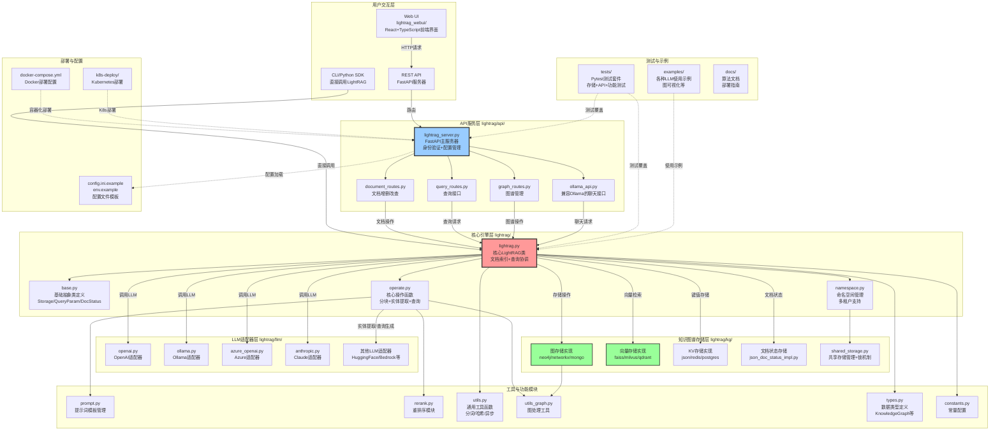
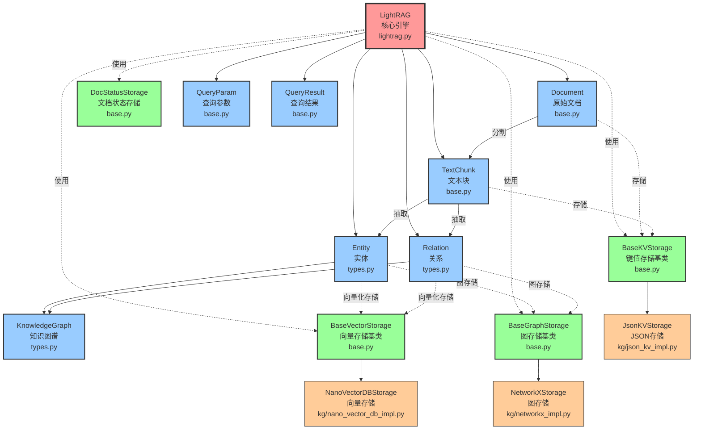
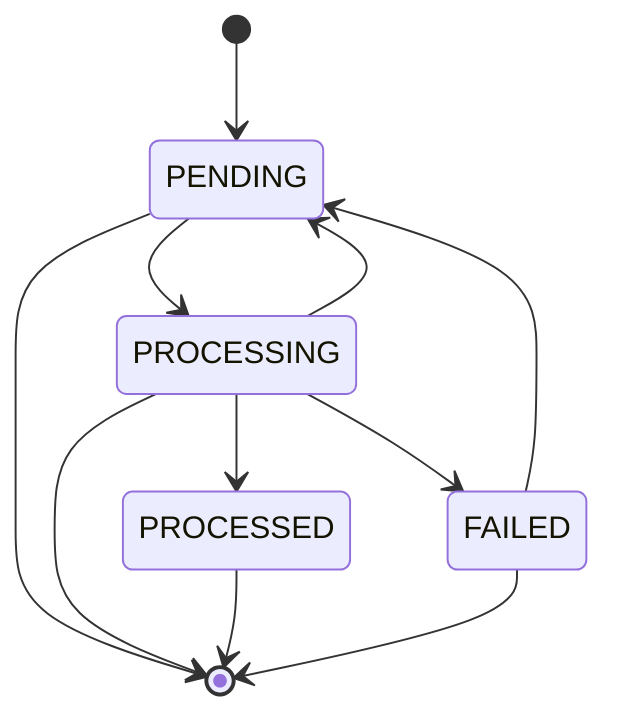
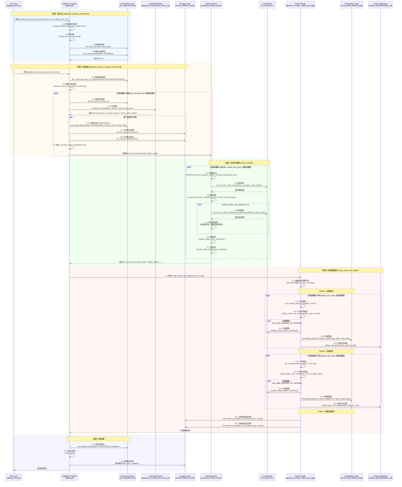

+++
date = '2025-10-01T00:00:00+08:00'
title = '如何借助 AI 阅读项目源码'
tags = ['AI', "源码"]
+++
  
本文以：[LightRAG](https://github.com/HKUDS/LightRAG)  项目举例说明



## 工具与模型

推荐使用的 IDE/Coding Agent 
- Cursor：在 coding 方面可能没有下面的 LLM 厂商的 coding agent 强大，但是支持切换不同模型， codebase rag 索引加速，以及内置渲染 mermaid 在交互上的友好，非常合适阅读源码
- Claude Code
- Codex

LLM 
- claude-4-sonnet
- gpt-5
- gpt-5-codex

## Workflow

遵循下面步骤逐步探索项目
- 技术栈
- 项目结构
- 项目模块文件之间的关系
- 关键数据模型
- 梳理核心流程
- 核心流程深入


### 技术栈

Prompt
```
这个项目使用到了哪些技术栈
```

### 项目结构

 Prompt
```
我想初步全局了解这个项目, 请解释一下项目目录结构，并标注出核心部分
```

#### Example
```shell
lightrag/                           ← 【核心包】主要业务逻辑
├── __init__.py                     # 包入口，导出LightRAG和QueryParam
├── lightrag.py                     # ⭐ 核心类LightRAG的实现
├── base.py                         # 基础类和接口定义
├── operate.py                      # 核心操作函数
├── prompt.py                       # LLM提示词模板
├── types.py                        # 类型定义
├── utils.py                        # 工具函数
├── utils_graph.py                  # 图相关工具
├── rerank.py                       # 重排序模型支持
├── constants.py                    # 常量定义
├── exceptions.py                   # 异常定义
├── namespace.py                    # 命名空间管理
│
├── kg/                             # ⭐【存储实现】知识图谱存储层
│   ├── json_kv_impl.py            # JSON键值存储（默认）
│   ├── neo4j_impl.py              # Neo4j图数据库
│   ├── postgres_impl.py           # PostgreSQL存储
│   ├── redis_impl.py              # Redis存储
│   ├── mongo_impl.py              # MongoDB存储
│   ├── milvus_impl.py             # Milvus向量数据库
│   ├── qdrant_impl.py             # Qdrant向量数据库
│   ├── faiss_impl.py              # Faiss向量存储
│   ├── networkx_impl.py           # NetworkX图存储（默认）
│   ├── nano_vector_db_impl.py     # 轻量向量数据库（默认）
│   └── shared_storage.py          # 共享存储接口
│
├── llm/                            # ⭐【LLM适配】大模型集成层
│   ├── openai.py                  # OpenAI模型
│   ├── ollama.py                  # Ollama本地模型
│   ├── gemini.py                  # Google Gemini
│   ├── azure_openai.py            # Azure OpenAI
│   └── llama_index_impl.py        # LlamaIndex集成
│
├── api/                            # ⭐【API服务】FastAPI Web服务
│   ├── lightrag_server.py         # 服务器入口
│   ├── config.py                  # 配置管理
│   ├── auth.py                    # 认证逻辑
│   ├── routers/                   # API路由
│   └── webui/                     # 前端Web UI静态资源
│
└── tools/                          # 辅助工具
    └── lightrag_visualizer/        # 知识图谱可视化工具
```

### 关系图谱

Prompt
```
我想初步全局了解这个项目，请使用 mermaid 描述文件的作用以及他们之间的关系
```


#### Example



### 关键实体以及关系

 Prompt
```
请梳理这个项目中核心的N个数据模型实体， 简要解释他们的定位作用以及所在文件，并使用 mermaid 描绘出他们的关系
```


#### Example

```markdown
### 核心数据模型实体
#### 1. Document (文档)
- 定位作用: 原始输入文档的完整存储和管理
- 所在文件: lightrag/base.py (DocProcessingStatus), lightrag/kg/postgres_impl.py (LIGHTRAG_DOC_FULL表结构)
- 关键属性:
- id: 文档唯一标识
- content: 文档完整内容
- file_path: 文件路径
- status: 处理状态 (pending/processing/processed/failed)
- metadata: 元数据信息

#### 2. TextChunk (文本块)
- 定位作用: 文档分割后的文本片段，是知识抽取的基本单元
- 所在文件: lightrag/base.py (TextChunkSchema), lightrag/operate.py (chunking_by_token_size)
- 关键属性:
- id: 块唯一标识
- content: 文本内容
- full_doc_id: 所属文档ID
- chunk_order_index: 在文档中的顺序
- tokens: token数量
  
#### 3. Entity (实体)
- 定位作用: 从文本中提取的知识图谱节点，代表现实世界的概念或对象
- 所在文件: lightrag/types.py (KnowledgeGraphNode), lightrag/kg/postgres_impl.py (LIGHTRAG_VDB_ENTITY表结构)
- 关键属性:
- entity_name: 实体名称
- entity_type: 实体类型
- description: 实体描述
- content_vector: 向量表示
- chunk_ids: 关联的文本块ID列表

#### 4. Relation (关系)
- 定位作用: 实体间的语义关系，构成知识图谱的边
- 所在文件: lightrag/types.py (KnowledgeGraphEdge), lightrag/kg/postgres_impl.py (LIGHTRAG_VDB_RELATION表结构)
- 关键属性:
- source_id: 源实体ID
- target_id: 目标实体ID
- relationship_keywords: 关系关键词
- description: 关系描述
- content_vector: 向量表示

#### 5. LightRAG (核心引擎)
- 定位作用: 系统的主控制器，协调所有存储和处理组件
- 所在文件: lightrag/lightrag.py
- 关键组件:
- full_docs: 完整文档存储
- text_chunks: 文本块存储
- entities_vdb: 实体向量存储
- relationships_vdb: 关系向量存储
- chunk_entity_relation_graph: 图存储
  
#### 6. 存储抽象层
- BaseKVStorage: 键值存储基类 (lightrag/base.py)
- BaseVectorStorage: 向量存储基类 (lightrag/base.py)
- BaseGraphStorage: 图存储基类 (lightrag/base.py)
- DocStatusStorage: 文档状态存储基类 (lightrag/base.py)

#### 7. QueryParam (查询参数)
- 定位作用: 查询配置和参数封装
- 所在文件: lightrag/base.py
- 关键属性: 查询模式、top_k、token限制等

#### 8. KnowledgeGraph (知识图谱)
- 定位作用: 图数据的统一表示格式
- 所在文件: lightrag/types.py
- 组成: nodes (节点列表) + edges (边列表)
```




### 状态机

Prompt
```
请梳理文档处理状态机有哪些状态以及对应状态变更事件，并使用 mermaid 描绘
按照下面格式要求输出
1. 状态枚举：以源代码加注释的形式给出
2. 状态变更事件：简要说明事件以及前后状态
3. mermaid 状态机：只关注 state 与 egde
```

#### Example

状态枚举

```python
class DocStatus(str, Enum):
	"""Document processing status"""
	PENDING = "pending" # 待处理状态：文档已入队，等待处理
	PROCESSING = "processing" # 处理中状态：文档正在被处理（分块、实体提取等）
	PROCESSED = "processed" # 已处理状态：文档处理完成，已成功索引
	FAILED = "failed" # 失败状态：文档处理过程中发生错误
```


状态变更事件

|事件|前状态|后状态|触发条件|
|---|---|---|---|
|文档入队|无|PENDING|新文档上传或扫描发现新文件|
|开始处理|PENDING|PROCESSING|处理管道开始处理文档（分块、实体提取）|
|处理成功|PROCESSING|PROCESSED|文档成功完成所有处理步骤（分块、实体提取、关系构建）|
|处理失败|PROCESSING|FAILED|处理过程中发生异常（文件读取失败、LLM调用失败等）|
|重新入队失败文档|FAILED|PENDING|系统重启或一致性检查时重置失败文档|
|重新入队处理中文档|PROCESSING|PENDING|系统重启时重置异常中断的处理中文档|
|文档删除|任意状态|无|用户主动删除文档|

状态机 mermaid




### 梳理核心流程

Prompt
```
我需要进一步了解这项目的核心实现，请你帮忙梳理出这个项目作为核心的 N 个流程，分点使用精炼的语言描述
```

#### Example
```markdown
## 1. 文档插入与索引流程（Document Insertion Pipeline）
主要步骤：
- 文档入队：通过 apipeline_enqueue_documents 验证文档 ID、去重、生成初始状态
- 文档分块：使用 chunking_by_token_size 按 token 大小分割文档（支持重叠）
- 向量化存储：将文本块转为向量嵌入存储到 chunks_vdb
- 实体提取：调用 extract_entities 处理每个文本块
- 知识图谱构建：调用 merge_nodes_and_edges 合并实体和关系
- 状态更新：更新文档处理状态（pending → processing → processed/failed）
核心文件： lightrag.py::ainsert, operate.py::chunking_by_token_size

## 2. 实体与关系提取流程（Entity Extraction）
主要步骤：
- 并发处理：使用信号量控制并发调用 LLM 处理多个文本块
- 初次提取：通过精心设计的 prompt 让 LLM 提取实体（entity_name, entity_type, description）和关系（source, target, keywords, description）
- 二次精炼（Gleaning）：可选的额外提取轮次以补充遗漏信息
- 结果解析：将 LLM 输出解析为结构化的节点和边数据
- 缓存机制：提取结果存入 llm_response_cache 避免重复计算
核心文件： operate.py::extract_entities, prompt.py::entity_extraction_system_prompt

## 3. 知识图谱构建与合并流程（Graph Construction）
主要步骤：
Phase 1 - 实体合并：
- 收集所有文本块中的同名实体
- 使用 _merge_nodes_then_upsert 合并描述（可能调用 LLM 总结）
- 同时更新图数据库（knowledge_graph_inst）和实体向量库（entities_vdb）
Phase 2 - 关系合并：
- 收集所有边（src, tgt 对）
- 使用 _merge_edges_then_upsert 合并关系描述和关键词
- 自动补全缺失的端点实体
- 更新图数据库和关系向量库（relationships_vdb）
Phase 3 - 持久化：
- 保存完整实体和关系列表到 full_entities_storage/full_relations_storage
核心特性： 分布式锁保证并发安全、两阶段提交避免数据不一致
核心文件： operate.py::merge_nodes_and_edges, operate.py::_merge_nodes_then_upsert


## 4. 多模式查询检索流程（Query Retrieval）
支持模式：
Local 模式：
- 提取关键词 → 向量检索相关实体 → 获取实体邻居关系 → 基于实体获取相关文本块
Global 模式：
- 提取关键词 → 向量检索相关关系 → 基于关系端点获取实体 → 获取相关文本块
Hybrid 模式：
- 综合 Local + Global 的检索结果
Mix 模式：
- 知识图谱检索 + 直接向量检索文本块
Naive 模式：
- 纯向量检索文本块（不使用知识图谱）
核心文件： operate.py::kg_query, operate.py::_build_query_context


## 5. 上下文构建与 Token 控制流程（Context Building）
4 阶段架构：
Stage 1 - 搜索：_perform_kg_search 执行向量检索获取候选实体/关系/文本块
Stage 2 - 截断：_apply_token_truncation 按优先级（度数/相似度）截断以满足 token 预算（max_entity_tokens, max_relation_tokens, max_total_tokens）
Stage 3 - 合并去重：_merge_chunks_from_kg_and_vector 合并来自知识图谱和向量检索的文本块、去重、可选 rerank
Stage 4 - 构建上下文：_build_llm_context 格式化为 LLM prompt，包含实体描述、关系描述、文本块内容
核心文件： operate.py::_build_query_context, operate.py::_build_llm_context


## 6. 多存储后端管理流程（Storage Management）
三类存储抽象：
KV 存储（BaseKVStorage）：
- 存储文本块、完整文档、LLM 响应缓存、文档状态
- 实现：JsonKV、MongoDB、PostgreSQL
向量存储（BaseVectorStorage）：
- 存储文本块向量、实体向量、关系向量
- 实现：NanoVectorDB、Milvus、Qdrant、FAISS
图存储（BaseGraphStorage）：
- 存储实体节点和关系边
- 实现：NetworkX、Neo4j、Memgraph、MongoDB

统一接口：
- initialize() - 初始化存储
- upsert() - 插入或更新数据
- query() - 查询数据
- index_done_callback() - 提交持久化
- drop() - 清空数据

核心文件： base.py、kg/ 目录下各实现文件

## 额外补充流程
7. 文档删除流程：通过 chunk_ids 级联删除图节点、边和向量
8. 重建流程：_rebuild_knowledge_from_chunks 从缓存的提取结果重建知识图谱
9. 增量更新流程：通过 filter_keys 过滤已存在文档避免重复处理
```

### 具体核心流程

这里针对上一步总结归纳出的流程进行进一步探索

```
讲解一下文档插入与处理流程的实现，并使用 mermaid 描述， 要求如下：  
1. 讲解部分不要陷入细节，结构化总结要点，让阅读者有个初步但是完整的的认知，同时使用 mermaid flowchart 描述  
2. 使用 mermaid sequenceDiagram 在上面的基础上完整地深入展开，以模块/文件/函数/实体等为单位描述，要求带上对应标识符让阅读者能够定位；可以在一个图表分阶段展示（不同颜色区分），和第一步中的结构化呼应  
3. 在上面的内容进一步提炼要点，列举出流程里面的重点，使用一到两句话指引阅读者下一步该深入什么，文字描述不要使用表格、emoji 等格式，用基本文字和层级列表描述
```


#### Example
```markdown
## LightRAG 的文档插入处理流程分为三个主要阶段：
### 阶段 1: 文档入队与预处理
- 验证或生成文档 ID（MD5 哈希）
- 去重检查，过滤已处理文档
- 初始化文档状态为 ENQUEUED
- 将文档内容存储到 full_docs 存储
### 阶段 2: 分块与实体提取
- 对文档进行分块（chunk）处理
- 并行存储文本块到向量数据库和键值存储
- 调用 LLM 提取每个块的实体和关系
- 解析 LLM 输出，构建实体-关系元组
### 阶段 3: 知识图谱构建
- 两阶段合并：先处理所有实体，再处理关系
- 实体去重与描述合并
- 构建知识图谱节点和边
- 更新向量数据库索引
  
{mermaid flowchart}

## 二、详细流程序列图
{mermaid sequenceDiagram}

## 三、流程要点与深入指引

### 1. 入口与调度机制
- 关键函数: LightRAG.ainsert() in lightrag/lightrag.py:901-934
- 流水线设计: 采用入队-处理分离模式，支持批量并发处理
- 并发控制: max_parallel_insert 参数控制同时处理的文档数量，默认为2
- 深入方向: 理解 apipeline_enqueue_documents 如何管理文档状态转换（ENQUEUED → PROCESSING → PROCESSED/FAILED）
### 2. 文档分块策略
- 关键函数: chunking_func 配置项，默认使用 token 分块
- 实现位置: lightrag/lightrag.py:1534-1542 调用分块函数
- 参数配置: chunk_token_size 和 chunk_overlap_token_size 控制块大小和重叠
- 深入方向: 查看 split_by_character 参数如何实现字符级分块与混合分块策略
### 3. 实体关系提取核心
- 关键函数: extract_entities() in lightrag/operate.py:2010-2187
- Prompt 工程: lightrag/prompt.py:11-69 定义实体提取系统提示词
- 解析逻辑: _process_extraction_result() in lightrag/operate.py:858-961 解析 LLM 输出
- 数据结构: 使用 tuple_delimiter（默认 <|#|>）分隔实体字段
- 深入方向: 研究 _handle_single_entity_extraction 和 _handle_single_relationship_extraction 如何处理格式错误和数据清洗

### 4. LLM 缓存机制
- 实现位置: use_llm_func_with_cache 封装 LLM 调用
- 缓存策略: 基于提取提示词的哈希进行缓存，避免重复提取
- 深入方向: 理解 llm_response_cache 如何存储和检索缓存，以及 cache_keys_collector 的批量更新机制
### 5. 知识图谱两阶段合并
- 关键函数: merge_nodes_and_edges() in lightrag/operate.py:1579-1836
- 阶段1: 并发处理所有实体，使用 keyed lock 保证同名实体串行合并
- 阶段2: 并发处理关系，自动补充缺失的端点实体
- 合并策略: merge_op_for_entity 和 merge_op_for_relationship 定义描述合并逻辑
- 深入方向: 查看 _merge_nodes_then_upsert 和 _merge_edges_then_upsert 如何实现增量更新和冲突解决
### 6. 向量数据库索引
- 实体向量化: 格式为 {entity_name}\n{description} 的拼接字符串
- 关系向量化: 类似实体，包含关系描述
- 文本块向量化: 直接使用原始 chunk 内容
- 深入方向: 理解 chunks_vdb.upsert()、entities_vdb.upsert() 的并发安全性和错误处理
### 7. 状态管理与容错
- 文档状态: DocStatus 枚举（ENQUEUED/PROCESSING/PROCESSED/FAILED）
- checkpoint 机制: 每个阶段完成后更新状态，支持断点续传
- 错误处理: process_document 内的 try-except 确保单个文档失败不影响其他文档
- 深入方向: 研究 _validate_and_fix_document_consistency 如何修复不一致状态
### 8. 并发与锁机制
- 文档级并发: Semaphore 控制同时处理的文档数
- 实体级锁: get_storage_keyed_lock 确保同名实体串行合并
- 全局配置: llm_model_max_async 参数控制图谱合并的并发度
- 深入方向: 理解 keyed lock 的实现原理以及如何避免死锁
```





