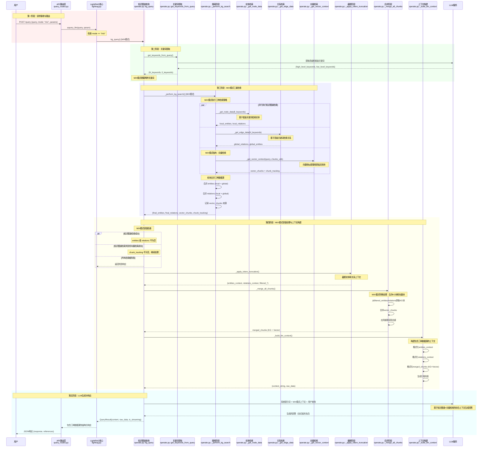

+++
date = '2025-10-02T00:00:00+08:00'
title = 'LightRAG 源码阅读'
+++

项目地址：[LightRAG](https://github.com/HKUDS/LightRAG) 
本文分析基于 Git commit 86195c613e0ced0e2fe8e1293b7d5c952359a7a1 版本



## 技术栈

- Python 3.10+
- FastAPI
- 键值存储 (KV Storage):
	- JSON文件存储
	- Redis
	- PostgreSQL
	- MongoDB
- 图数据库 (Graph Storage):
	- NetworkX (内存图)
	- Neo4j
	- PostgreSQL (图扩展)
	- MongoDB
	- Memgraph
- 向量数据库 (Vector Storage):
	- NanoVectorDB (轻量级)
	- Milvus
	- Faiss
	- Qdrant
	- PostgreSQL (pgvector扩展)
	- MongoDB

## 目录结构

```shell
LightRAG/
├── lightrag/                    # 【核心】主要代码包
│   ├── __init__.py             # 包初始化，导出主要类
│   ├── lightrag.py             # 【核心】主要的LightRAG类定义
│   ├── operate.py              # 【核心】核心操作逻辑（查询、插入等）
│   ├── base.py                 # 【核心】基础抽象类定义
│   ├── types.py                # 类型定义
│   ├── utils.py                # 【核心】工具函数和缓存机制
│   ├── prompt.py               # 【核心】提示词模板
│   ├── namespace.py            # 命名空间定义
│   ├── constants.py            # 常量定义
│   ├── exceptions.py           # 异常定义
│   ├── rerank.py               # 重排序功能
│   ├── utils_graph.py          # 图相关工具
│   │
│   ├── kg/                     # 【核心】知识图谱存储层
│   │   ├── __init__.py         # 存储实现映射
│   │   ├── json_kv_impl.py     # JSON键值存储实现
│   │   ├── postgres_impl.py    # PostgreSQL存储实现
│   │   ├── mongo_impl.py       # MongoDB存储实现
│   │   ├── redis_impl.py       # Redis存储实现
│   │   ├── neo4j_impl.py       # Neo4j图数据库实现
│   │   ├── milvus_impl.py      # Milvus向量数据库实现
│   │   ├── faiss_impl.py       # Faiss向量数据库实现
│   │   ├── qdrant_impl.py      # Qdrant向量数据库实现
│   │   └── shared_storage.py   # 共享存储逻辑
│   │
│   ├── llm/                    # 【核心】大语言模型集成层
│   │   ├── openai.py           # OpenAI API集成
│   │   ├── azure_openai.py     # Azure OpenAI集成
│   │   ├── ollama.py           # Ollama本地模型集成
│   │   ├── zhipu.py            # 智谱AI集成
│   │   ├── hf.py               # HuggingFace模型集成
│   │   ├── nvidia_openai.py    # Nvidia AI集成
│   │   └── llama_index_impl.py # LlamaIndex集成
│   │
│   ├── api/                    # 【核心】Web服务和API
│   │   ├── lightrag_server.py  # FastAPI服务器主文件
│   │   ├── config.py           # API配置
│   │   ├── auth.py             # 认证机制
│   │   ├── routers/            # API路由
│   │   │   ├── query_routes.py # 查询API路由
│   │   │   ├── document_routes.py # 文档管理API
│   │   │   ├── graph_routes.py # 图可视化API
│   │   │   └── ollama_api.py   # Ollama兼容API
│   │   └── webui/              # 前端静态文件
│   │
│   └── tools/                  # 辅助工具
│       └── lightrag_visualizer/ # 可视化工具
│
├── lightrag_webui/             # 【核心】前端Web界面
│   ├── src/                    # React源代码
│   ├── package.json            # 前端依赖配置
│   ├── vite.config.ts          # 构建配置
│   └── tailwind.config.js      # 样式配置
│
├── examples/                   # 示例代码
│   ├── lightrag_openai_demo.py # OpenAI使用示例
│   ├── lightrag_ollama_demo.py # Ollama使用示例
│   └── unofficial-sample/      # 社区贡献示例
│
├── tests/                      # 测试代码
│   ├── test_lightrag_ollama_chat.py
│   └── test_graph_storage.py
│
├── docs/                       # 文档
├── k8s-deploy/                 # Kubernetes部署配置
├── reproduce/                  # 论文复现代码
├── pyproject.toml              # 【核心】Python项目配置
├── docker-compose.yml          # Docker部署配置
├── env.example                 # 环境变量模板
└── README.md                   # 项目说明文档
```

### 关系图谱


## 核心数据模型

- **LightRAG** (lightrag.py)：系统主控制器和统一入口
	- 协调所有组件的工作
	- 提供统一的API接口
	- 管理配置和生命周期
	- 控制文档插入和查询流程
- **BaseKVStorage** (base.py)：键值存储抽象基类
	- 定义键值存储的统一接口
	- 管理文档、文本块、LLM缓存等结构化数据
	- 提供upsert、get、filter等基础操作
- **BaseVectorStorage** (base.py)：向量存储抽象基类
	- 管理实体、关系、文本块的向量嵌入
	- 提供向量相似度查询功能
	- 支持批量向量操作
- **BaseGraphStorage** (base.py)：图存储抽象基类
	- 管理知识图谱的节点和边
	- 提供图遍历和查询功能
	- 支持实体关系的图结构操作
- **EmbeddingFunc** (utils.py)：嵌入函数封装器
	- 封装不同的嵌入模型
	- 提供统一的文本向量化接口
	- 管理嵌入维度和批处理
- **CacheData** (utils.py)：缓存数据结构
	- 封装LLM响应缓存信息
	- 管理缓存类型和元数据
	- 支持缓存的序列化和反序列化
- **DocumentManager** (api/routers/document_routes.py)：文档管理器
	- 处理文档上传和管理
	- 管理文档状态和元数据
	- 支持批量文档处理
-  **Entity & Relation** (隐式数据结构)：知识图谱核心数据
	- Entity: 表示知识图谱中的实体节点
	- Relation: 表示实体间的关系边
	- 存储在各种存储后端中
- **TextChunk** (隐式数据结构)：文本分块数据
	- 存储文档分割后的文本片段
	- 包含位置信息、token数量等元数据
	- 作为RAG检索的基本单元

### 数据模型关系图


### 核心储存数据


存储包括几类数据
- KV 数据库 
	- 原始完整文档
	- 原始 chunks
	- 实体汇总列表
	- 关系汇总列表
	- LLM响应缓存
- 向量数据库
	- 分块向量
	- 实体向量
	- 关系向量
- 图数据库
	- 实体节点和关系边
- 文档状态数据库
	- 文档处理状态和元数据


## 核心流程概述

### 文档插入流程
- 文档预处理: 文本清理、编码转换、格式标准化
- 智能分块: 基于token数量和语义边界进行文档分割
- 实体关系提取: 使用LLM从文本块中提取实体和关系
- 知识图谱构建: 将提取的实体关系构建成图结构
- 向量化存储: 生成实体、关系、文本块的嵌入向量并存储
- 元数据管理: 记录文档状态、处理进度、错误信息

### 实体关系提取流程
- 文本预处理: 清理和标准化输入文本
- 提示词构建: 基于模板生成实体关系提取提示
- LLM调用: 使用大语言模型进行实体关系识别
- 结果解析: 解析LLM输出的结构化实体关系数据
- 数据验证: 验证提取结果的格式和完整性
- 增量更新: 将新提取的实体关系合并到现有知识图谱

### 知识图谱管理流程
- 实体管理: 创建、编辑、删除、合并实体节点
- 关系管理: 建立、修改、删除实体间的关系边
- 图遍历: 基于图结构进行邻居查找和路径搜索
- 图更新: 增量更新图结构，保持数据一致性
- 图可视化: 生成图的可视化表示供前端展示


### 查询处理流程
- 查询解析: 分析用户查询意图和参数配置
- 多模式检索:
	- Local模式: 基于实体的局部上下文检索
	- Global模式: 基于关系的全局知识检索
	- Hybrid模式: 结合Local和Global的混合检索
	- Naive模式: 简单的向量相似度检索
	- Mix模式: 整合知识图谱和向量检索
- 上下文组装: 将检索结果组织成结构化上下文
- LLM生成: 基于上下文生成最终答案
- 结果后处理: 格式化输出、添加引用信息

### 向量检索流程
- 查询向量化: 将用户查询转换为嵌入向量
- 相似度计算: 在向量空间中计算相似度分数
- 结果排序: 按相似度分数对检索结果排序
- 阈值过滤: 根据配置的阈值过滤低质量结果
- 重排序: 可选的使用重排序模型优化结果顺序
- 结果聚合: 合并来自不同向量存储的检索结果


## 核心流程详解

### 文档插入流程
理解文档插入流程需要结合 '核心储存数据' 章节理解


上面的流程图展示了文档插入的核心流程，除此之外，还有一些工程性的流程需要关注一下
- 数据修复 `_validate_and_fix_document_consistency`: 在文档处理流水线开始前调用，检查并修复doc_status(文档状态)和full_docs(完整文档)之间的数据不一致问题。这种不一致可能会出现在各种异常如程序异常退出、后端储存故障等。
- LLM Response Cache 策略
- 并发处理策略


#### 分块算法

分块是在 token 格式下进行的，先将字符转使用 `Tokenizer` 转成 token，再进行分块，但是最终返回出去 content 会使用 `Tokenizer`  转成为原文

chunk 格式
- tokens：token 数量
- content：原始文本
- chunk_order_index：分块的顺序

```python
{
	"tokens": min(max_token_size, len(tokens) - start),
	"content": chunk_content.strip(),
	"chunk_order_index": index,
}
```


支持三种分块模式
- 按分隔符分割：
	- 纯语义分割：`split_by_character_only = true`  完全按分隔符切分
- 按 token size 分割：
	- 每块大小控制在`max_token_size`,  通过 `overlap_token_size` 控制分块之间重叠区间，保持语义连续性
- 混合分割：在分隔符分割后的子块基础上，如果超过了 `max_token_size`，再进行  token size 分割


```python
def chunking_by_token_size(
    tokenizer: Tokenizer,
    content: str,
    split_by_character: str | None = None,
    split_by_character_only: bool = False,
    overlap_token_size: int = 128,
    max_token_size: int = 1024,
) -> list[dict[str, Any]]:
    tokens = tokenizer.encode(content)
    results: list[dict[str, Any]] = []
    if split_by_character:
        raw_chunks = content.split(split_by_character)
        new_chunks = []
        if split_by_character_only:
            for chunk in raw_chunks:
                _tokens = tokenizer.encode(chunk)
                new_chunks.append((len(_tokens), chunk))
        else:
            for chunk in raw_chunks:
                _tokens = tokenizer.encode(chunk)
                if len(_tokens) > max_token_size:
                    for start in range(
                        0, len(_tokens), max_token_size - overlap_token_size
                    ):
                        chunk_content = tokenizer.decode(
                            _tokens[start : start + max_token_size]
                        )
                        new_chunks.append(
                            (min(max_token_size, len(_tokens) - start), chunk_content)
                        )
                else:
                    new_chunks.append((len(_tokens), chunk))
        for index, (_len, chunk) in enumerate(new_chunks):
            results.append(
                {
                    "tokens": _len,
                    "content": chunk.strip(),
                    "chunk_order_index": index,
                }
            )
    else:
        for index, start in enumerate(
            range(0, len(tokens), max_token_size - overlap_token_size)
        ):
            chunk_content = tokenizer.decode(tokens[start : start + max_token_size])
            results.append(
                {
                    "tokens": min(max_token_size, len(tokens) - start),
                    "content": chunk_content.strip(),
                    "chunk_order_index": index,
                }
            )
    return results
```

#### 插入向量数据库（NanoVectorDB）

不同的向量数据库的 `upsert` 流程有不同的实现，这里以 `NanoVectorDB` 实现讲解。
包括下面几个关键流程
- （批量）嵌入：将原始文本 embedding 转成向量，批量操作以提升效率
- 向量压缩流程: 


```python
if len(embeddings) == len(list_data):
	for i, d in enumerate(list_data):
		# 步骤1：降低精度 - Float64/32 → Float16
		vector_f16 = embeddings[i].astype(np.float16)
		# 步骤2：二进制压缩 - 使用zlib算法
		compressed_vector = zlib.compress(vector_f16.tobytes())
		# 步骤3：编码存储 - 二进制 → Base64字符串
		encoded_vector = base64.b64encode(compressed_vector).decode("utf-8")
		# 步骤4：双重存储
		d["vector"] = encoded_vector # 压缩后的版本，用于持久化存储
		d["__vector__"] = embeddings[i] # 原始精度版本，用于内存计算
	client = await self._get_client()
	results = client.upsert(datas=list_data)
	return results
```


#### 知识图谱构建

知识图谱用于建立原始文档之间的实体的关系，关系的提取包括两轮的 LLM 任务：
- 第一轮提取出基本的实体和关系。
- 第二轮 Gleaning  可选，基于第一轮的输出再进行一次 二次输出
	- 提高召回率：发现遗漏的实体和关系
	- 提高准确性：修正格式错误和不完整的提取
在进行两轮任务后，会合并两轮输出的实体与关系，选择出描述最详细的结果。
在存储进数据库的时候，还会根据库里已经存在的实体与关系，再进行合并处理。

**上下文与提示词**

系统中预定义了实体类型在，不在此列表中的会被归类为 Other 类型
```json
[
    "Person",
    "Creature",
    "Organization",
    "Location",
    "Event",
    "Concept",
    "Method",
    "Content",
    "Data",
    "Artifact",
    "NaturalObject",
]
```



```
---角色---

您是知识图谱专家，负责从输入文本中提取实体和关系。

---说明---

1. **实体提取与输出：**

* **识别：** 明确识别输入文本中的定义清晰且具有意义的实体。

* **实体详细信息：** 对于每个识别的实体，提取以下信息：

* `entity_name`：实体的名称。如果实体名称不区分大小写，则将每个重要单词的首字母大写（标题大小写）。在整个提取过程中确保**命名一致**。

* `entity_type`：使用以下类型之一对实体进行分类：`{entity_types}`。如果提供的实体类型都不适用，则不要添加新的实体类型，将其归类为“其他”。

* `entity_description`：根据输入文本中提供的信息，提供关于实体属性和活动的简洁而全面的描述。

* **输出格式 - 实体：** 每个实体输出4个字段，由`{tuple_delimiter}`分隔，在同一行上。第一个字段必须是字面字符串`entity`。

* 格式：`entity{tuple_delimiter}entity_name{tuple_delimiter}entity_type{tuple_delimiter}entity_description`

2. **关系提取与输出：**

* **识别：** 识别先前提取实体之间直接、明确且具有意义的联系。

* **N元关系分解：** 如果单个语句描述了涉及两个以上实体（N元关系）的关系，将其分解为多个二元（两个实体）关系对进行单独描述。

* **示例：** 对于“Alice、Bob和Carol合作完成了项目X”，提取二元关系，如“Alice与项目X合作”、“Bob与项目X合作”和“Carol与项目X合作”，或者“Alice与Bob合作”，基于最合理的二元解释。

* **关系详细信息：** 对于每个二元关系，提取以下字段：

* `source_entity`：源实体的名称。确保与实体提取**命名一致**。如果名称不区分大小写，则将每个重要单词的首字母大写（标题大小写）。

* `target_entity`：目标实体的名称。确保与实体提取**命名一致**。如果名称不区分大小写，则将每个重要单词的首字母大写（标题大小写）。

* `relationship_keywords`：一个或多个总结关系整体性质、概念或主题的高级关键词。此字段中的多个关键词必须用逗号`,`分隔。**不要在此字段中使用`{tuple_delimiter}`分隔多个关键词。**

* `relationship_description`：对源实体和目标实体之间关系性质的简洁解释，提供其连接的明确理由。

* **输出格式 - 关系：** 每个关系输出5个字段，由`{tuple_delimiter}`分隔，在同一行上。第一个字段必须是字面字符串`relation`。

* 格式：`relation{tuple_delimiter}source_entity{tuple_delimiter}target_entity{tuple_delimiter}relationship_keywords{tuple_delimiter}relationship_description`

3. **分隔符使用协议：**

* `{tuple_delimiter}`是一个完整、原子的标记，**不得填充内容**。它仅作为字段分隔符。

* **错误示例：** `entity{tuple_delimiter}Tokyo<|location|>Tokyo is the capital of Japan.`

* **正确示例：** `entity{tuple_delimiter}Tokyo{tuple_delimiter}location{tuple_delimiter}Tokyo is the capital of Japan.`

4. **关系方向与重复：**

* 将所有关系视为**无向**，除非明确说明否则。交换源实体和目标实体对于无向关系不构成新的关系。

* 避免输出重复的关系。

5. **输出顺序与优先级：**

* 首先输出所有提取的实体，然后输出所有提取的关系。

* 在关系列表中，优先输出对输入文本核心意义**最显著**的关系。

6. **上下文与客观性：**

* 确保所有实体名称和描述都使用**第三人称**。

* 明确命名主题或对象；**避免使用代词**，如`this article`、`this paper`、`our company`、`I`、`you`和`he/she`。

7. **语言与专有名词：**

* 整个输出（实体名称、关键词和描述）必须使用`{language}`。

* 如果没有提供合适的、广泛接受的翻译或会导致歧义，则应保留专有名词（例如个人名称、地点名称、组织名称）的原语言。

8. **完成信号：** 在所有实体和关系完全提取并输出后，仅输出字面字符串`{completion_delimiter}`。

---示例---

{examples}

---待处理的真实数据---

<输入>

实体类型：[{entity_types}]

文本：
{input_text}

```






```
---任务---

从待处理输入文本中提取实体和关系。

---说明---

1. **严格遵循格式：** 严格遵循系统提示中指定的实体和关系列表的所有格式要求，包括输出顺序、字段分隔符和专有名词处理。

2. **仅输出内容：** 仅输出提取的实体和关系列表。不要包括任何介绍性或结论性评论、解释或列表前后附加的任何文本。

3. **完成信号：** 在提取并呈现所有相关实体和关系后，输出 `{completion_delimiter}` 作为最后一行。

4. **输出语言：** 确保输出语言为 {language}。专有名词（例如，人名、地名、组织名称）必须保持其原始语言，不得翻译。

<输出>
```



```
---任务---

根据上一次提取任务，从输入文本中识别和提取任何**遗漏或格式错误**的实体和关系。

---说明---

1. **严格遵守系统格式：** 严格遵循系统说明中规定的实体和关系列表的所有格式要求，包括输出顺序、字段分隔符和专有名词处理。

2. **关注修正/添加：**

* **不要**重新输出在上一次任务中**正确且完整**提取的实体和关系。

* 如果在上一次任务中**遗漏**了实体或关系，现在根据系统格式提取并输出它。

* 如果在上一次任务中实体或关系**截断、字段缺失或格式不正确**，以指定格式重新输出*修正和完整*版本。

3. **输出格式 - 实体：** 每个实体输出4个字段，字段之间用`{tuple_delimiter}`分隔，单行输出。第一个字段*必须*是字符串`entity`。

4. **输出格式 - 关系：** 每个关系输出5个字段，字段之间用`{tuple_delimiter}`分隔，单行输出。第一个字段*必须*是字符串`relation`。

5. **仅输出内容：** 仅输出提取的实体和关系列表。不要包括任何介绍性或结论性说明、解释或列表前后附加的文本。

6. **完成信号：** 在所有相关遗漏或修正的实体和关系提取并呈现后，输出`{completion_delimiter}`作为最后一行。

7. **输出语言：** 确保输出语言为{language}。专有名词（例如，人名、地名、组织名）必须保持其原始语言，不得翻译。

<输出>
```




**实体与关系**

实体 Node 示例
```json
{
	"entity_name": "LightRAG",
	"entity_type": "organization",
	"description": "LightRAG is a project focused on Retrieval-Augmented Generation, developed by HKUDS, and available on GitHub and PyPI.",
	"source_id": "chunk-b3574b583039b34744f0d1f4dde878d3",
	"file_path": "README-zh.md",
	"timestamp": 1759317110
}
```

关系 Edge 示例
```json
{
	"src_id": "LightRAG",
	"tgt_id": "Retrieval-Augmented Generation",
	"weight": 1.0,
	"description": "LightRAG implements Retrieval-Augmented Generation technology.",
	"keywords": "implementation, technology",
	"source_id": "chunk-b3574b583039b34744f0d1f4dde878d3",
	"file_path": "README-zh.md",
	"timestamp": 1759317110
}
```


 **实体合并** `_merge_nodes_then_upsert`

在实体更新到数据库时，需要进行合并操作，因为可能已经存在同一个实体多个描述。合并逻辑如下
- 实体类型：选择出现次数最多的
- 实体描述：多个描述去重排序后，合并
	- 如果描述少且简单：直接拼接
	- 如果描述多或复杂：使用LLM智能合并成一个综合描述
- 来源ID：去重
- 文件路径：去重合并拼接

**关系合并**  `_merge_edges_then_upsert`

同样在处理关系的时候，也需要进行相关的合并操作。合并逻辑如下
- 权重处理：将所有新关系的权重与已存在关系的权重累加
- 描述去重和排序，再简单合并或者使用 LLM 总结
- 关键词去重合并
- 来源信息合并，包括源ID和源文件
- 自动创建缺失实体：如果出现了不存在的实体，会自动创建一个未知类型的实体并储存，确保知识图谱的完整性，避免"悬空"关系。


### 查询&检索流程
在理解了文档插入流程后，查询流程我们重点关注被储存的数据是如何用于检索的。

LightRAG 的查询处理会经过下面四层处理
- API 层：接收用户查询请求，支持多种查询模式（local、global、hybrid、naive、mix、bypass）
- 查询路由层：根据查询模式选择相应的处理策略，包括知识图谱查询（kg_query）和朴素查询（naive_query）
- 知识检索层：四阶段处理架构 - 搜索、截断、合并、构建上下文
- LLM 生成层：基于检索到的上下文生成最终回答

#### 查询模式策略
- local模式专注于特定实体及其直接关系，适合精确查询
- global模式分析整体关系模式，适合概念性查询
- hybrid模式结合local和global优势，提供全面结果
- **mix模式整合知识图谱和向量检索，是推荐的默认模式**
- naive模式仅使用向量相似度搜索
- bypass模式直接调用LLM

#### 流程时序
下面以 mix 模式展开描述整个查询检索的流程




#### 关键词提取
**提取关键词这一步服务于知识图谱的检索，为了更好的捕获问题中的实体以及其关系**，由 LLM 提取 Query 中的低级关键词和高级关键词
- 低级关键词：用于识别具体实体、专有名词、专业术语、产品名称或具体事项的细节信息
- 高级关键词：用于捕捉核心意图、主题领域或问题类型的宏观概念

```json
示例
查询：“国际贸易如何影响全球经济稳定？”
输出：
{
"high_level_keywords": ["国际贸易", "全球经济稳定", "经济影响"],
"low_level_keywords": ["贸易协定", "关税", "货币兑换", "进口", "出口"]
}


查询：“森林砍伐对生物多样性的环境影响有哪些？”
输出：
{
"high_level_keywords": ["环境影响", "森林砍伐", "生物多样性丧失"],
"low_level_keywords": ["物种灭绝", "栖息地破坏", "碳排放", "热带雨林", "生态系统"]
}
```



```
---角色---

您是一位专业的关键词提取专家，专注于分析检索增强生成（RAG）系统中的用户查询。您的目标是识别用户查询中的高层次和低层次关键词，以实现高效文档检索。

---目标---

针对用户查询，您的任务是提取两种不同类型的关键词：

1. **高层次关键词**：用于捕捉核心意图、主题领域或问题类型的宏观概念。

2. **低层次关键词**：用于识别具体实体、专有名词、专业术语、产品名称或具体事项的细节信息。

---规则与限制---

1. **输出格式**：输出必须是纯JSON对象格式，不得包含任何说明文字、Markdown代码标记（如```json）或前后缀文本。该输出将直接由JSON解析器处理。

2. **来源依据**：所有关键词必须严格源自用户查询，且两个关键词类别都必须包含实际内容。

3. **简洁性与意义**：关键词应为简洁的单词或意义明确的短语。当多词短语代表单一概念时优先提取完整短语，例如从“苹果公司最新财报”中应提取“最新财报”和“苹果公司”，而非拆分为“最新”“财务”“报告”“苹果”。

4. **特殊情况处理**：对于过于简单、模糊或无意义的查询（如“你好”“好的”“乱码字符”），需返回包含空列表的JSON对象。

---示例---

```



#### 基于低级关键词检索实体
这一步通过查询低级关键词找到最相关的实体及其关联关系，包括下面3个关键查询
1. 查询向量库中的实体数据：基于语义相似度找到与低级关键词最相关的实体
2. 查询知识图谱中的实体数据：找出上一步实体在知识图谱中的详细数据
3. 查询知识图谱中的关系数据：计算实体在图中的连接度数（用于作重要性评估）

#### 基于高级关键词检索关系

这一步基于高级关键词找到最相关的关系及其连接的实体，专注于发现知识图谱中的关系模式和全局结构信息。
包括下面3份关键查询
1. 查询向量库中的关系数据：基于语义相似度找到与高级关键词最相关的关系
2. 查询知识图谱中的关系数据：从知识图谱批量获取关系的详细属性信息
3. 实体提取：从找到的关系中提取所有涉及的实体


#### 向量检索
基础RAG里面的检索流程， 使用余弦相似度匹配出最相关的 TopK 个分块向量

#### 


