+++
date = '2025-10-02T00:00:00+08:00'
title = 'LightRAG 源码阅读'
+++

项目地址：[LightRAG](https://github.com/HKUDS/LightRAG) 
本文分析基于 Git commit 86195c613e0ced0e2fe8e1293b7d5c952359a7a1 版本



## 技术栈

- Python 3.10+
- FastAPI
- 键值存储 (KV Storage):
	- JSON文件存储
	- Redis
	- PostgreSQL
	- MongoDB
- 图数据库 (Graph Storage):
	- NetworkX (内存图)
	- Neo4j
	- PostgreSQL (图扩展)
	- MongoDB
	- Memgraph
- 向量数据库 (Vector Storage):
	- NanoVectorDB (轻量级)
	- Milvus
	- Faiss
	- Qdrant
	- PostgreSQL (pgvector扩展)
	- MongoDB

## 目录结构

```shell
LightRAG/
├── lightrag/                    # 【核心】主要代码包
│   ├── __init__.py             # 包初始化，导出主要类
│   ├── lightrag.py             # 【核心】主要的LightRAG类定义
│   ├── operate.py              # 【核心】核心操作逻辑（查询、插入等）
│   ├── base.py                 # 【核心】基础抽象类定义
│   ├── types.py                # 类型定义
│   ├── utils.py                # 【核心】工具函数和缓存机制
│   ├── prompt.py               # 【核心】提示词模板
│   ├── namespace.py            # 命名空间定义
│   ├── constants.py            # 常量定义
│   ├── exceptions.py           # 异常定义
│   ├── rerank.py               # 重排序功能
│   ├── utils_graph.py          # 图相关工具
│   │
│   ├── kg/                     # 【核心】知识图谱存储层
│   │   ├── __init__.py         # 存储实现映射
│   │   ├── json_kv_impl.py     # JSON键值存储实现
│   │   ├── postgres_impl.py    # PostgreSQL存储实现
│   │   ├── mongo_impl.py       # MongoDB存储实现
│   │   ├── redis_impl.py       # Redis存储实现
│   │   ├── neo4j_impl.py       # Neo4j图数据库实现
│   │   ├── milvus_impl.py      # Milvus向量数据库实现
│   │   ├── faiss_impl.py       # Faiss向量数据库实现
│   │   ├── qdrant_impl.py      # Qdrant向量数据库实现
│   │   └── shared_storage.py   # 共享存储逻辑
│   │
│   ├── llm/                    # 【核心】大语言模型集成层
│   │   ├── openai.py           # OpenAI API集成
│   │   ├── azure_openai.py     # Azure OpenAI集成
│   │   ├── ollama.py           # Ollama本地模型集成
│   │   ├── zhipu.py            # 智谱AI集成
│   │   ├── hf.py               # HuggingFace模型集成
│   │   ├── nvidia_openai.py    # Nvidia AI集成
│   │   └── llama_index_impl.py # LlamaIndex集成
│   │
│   ├── api/                    # 【核心】Web服务和API
│   │   ├── lightrag_server.py  # FastAPI服务器主文件
│   │   ├── config.py           # API配置
│   │   ├── auth.py             # 认证机制
│   │   ├── routers/            # API路由
│   │   │   ├── query_routes.py # 查询API路由
│   │   │   ├── document_routes.py # 文档管理API
│   │   │   ├── graph_routes.py # 图可视化API
│   │   │   └── ollama_api.py   # Ollama兼容API
│   │   └── webui/              # 前端静态文件
│   │
│   └── tools/                  # 辅助工具
│       └── lightrag_visualizer/ # 可视化工具
│
├── lightrag_webui/             # 【核心】前端Web界面
│   ├── src/                    # React源代码
│   ├── package.json            # 前端依赖配置
│   ├── vite.config.ts          # 构建配置
│   └── tailwind.config.js      # 样式配置
│
├── examples/                   # 示例代码
│   ├── lightrag_openai_demo.py # OpenAI使用示例
│   ├── lightrag_ollama_demo.py # Ollama使用示例
│   └── unofficial-sample/      # 社区贡献示例
│
├── tests/                      # 测试代码
│   ├── test_lightrag_ollama_chat.py
│   └── test_graph_storage.py
│
├── docs/                       # 文档
├── k8s-deploy/                 # Kubernetes部署配置
├── reproduce/                  # 论文复现代码
├── pyproject.toml              # 【核心】Python项目配置
├── docker-compose.yml          # Docker部署配置
├── env.example                 # 环境变量模板
└── README.md                   # 项目说明文档
```

### 关系图谱

```mermaid
graph TB
    subgraph "用户交互层"
        WebUI[Web UI<br/>lightrag_webui/<br/>React+TypeScript前端界面]
        CLI[CLI/Python SDK<br/>直接调用LightRAG]
        API[REST API<br/>FastAPI服务器]
    end

    subgraph "API服务层 lightrag/api/"
        Server[lightrag_server.py<br/>FastAPI主服务器<br/>身份验证+配置管理]
        DocRouter[document_routes.py<br/>文档增删改查]
        QueryRouter[query_routes.py<br/>查询接口]
        GraphRouter[graph_routes.py<br/>图谱管理]
        OllamaAPI[ollama_api.py<br/>兼容Ollama的聊天接口]
    end

    subgraph "核心引擎层 lightrag/"
        Main[lightrag.py<br/>核心LightRAG类<br/>文档索引+查询协调]
        Base[base.py<br/>基础抽象类定义<br/>Storage/QueryParam/DocStatus]
        Operate[operate.py<br/>核心操作函数<br/>分块+实体提取+查询]
        Namespace[namespace.py<br/>命名空间管理<br/>多租户支持]
    end

    subgraph "LLM适配器层 lightrag/llm/"
        OpenAI[openai.py<br/>OpenAI适配器]
        Ollama[ollama.py<br/>Ollama适配器]
        Azure[azure_openai.py<br/>Azure适配器]
        Anthropic[anthropic.py<br/>Claude适配器]
        Others[其他LLM适配器<br/>HuggingFace/Bedrock等]
    end

    subgraph "知识图谱存储层 lightrag/kg/"
        GraphStorage[图存储实现<br/>neo4j/networkx/mongo]
        VectorStorage[向量存储实现<br/>faiss/milvus/qdrant]
        KVStorage[KV存储实现<br/>json/redis/postgres]
        DocStatus[文档状态存储<br/>json_doc_status_impl.py]
        SharedStorage[shared_storage.py<br/>共享存储管理+锁机制]
    end

    subgraph "工具与功能模块"
        Prompt[prompt.py<br/>提示词模板管理]
        Rerank[rerank.py<br/>重排序模块]
        Utils[utils.py<br/>通用工具函数<br/>分词/哈希/异步]
        UtilsGraph[utils_graph.py<br/>图处理工具]
        Types[types.py<br/>数据类型定义<br/>KnowledgeGraph等]
        Constants[constants.py<br/>常量配置]
    end

    subgraph "部署与配置"
        Docker[docker-compose.yml<br/>Docker部署配置]
        K8s[k8s-deploy/<br/>Kubernetes部署]
        Config[config.ini.example<br/>env.example<br/>配置文件模板]
    end

    subgraph "测试与示例"
        Tests[tests/<br/>Pytest测试套件<br/>存储+API+功能测试]
        Examples[examples/<br/>各种LLM使用示例<br/>图可视化等]
        Docs[docs/<br/>算法文档<br/>部署指南]
    end

    %% 用户交互层连接
    WebUI -->|HTTP请求| API
    CLI -->|直接调用| Main
    API -->|路由| Server

    %% API层内部连接
    Server --> DocRouter
    Server --> QueryRouter
    Server --> GraphRouter
    Server --> OllamaAPI

    %% API到核心层
    DocRouter -->|文档操作| Main
    QueryRouter -->|查询请求| Main
    GraphRouter -->|图谱操作| Main
    OllamaAPI -->|聊天请求| Main

    %% 核心层内部
    Main --> Base
    Main --> Operate
    Main --> Namespace
    Operate --> Prompt
    Operate --> Rerank

    %% 核心层到LLM
    Main -->|调用LLM| OpenAI
    Main -->|调用LLM| Ollama
    Main -->|调用LLM| Azure
    Main -->|调用LLM| Anthropic
    Operate -->|实体提取/查询生成| Others

    %% 核心层到存储层
    Main -->|存储操作| GraphStorage
    Main -->|向量检索| VectorStorage
    Main -->|键值存储| KVStorage
    Main -->|文档状态| DocStatus
    Namespace --> SharedStorage

    %% 工具模块支持
    Main --> Utils
    Main --> Types
    Main --> Constants
    Operate --> UtilsGraph
    GraphStorage --> UtilsGraph

    %% 配置与部署
    Server -.配置加载.-> Config
    Docker -.容器化部署.-> Server
    K8s -.K8s部署.-> Server

    %% 测试与文档
    Tests -.测试覆盖.-> Main
    Tests -.测试覆盖.-> Server
    Examples -.使用示例.-> Main

    style Main fill:#ff9999,stroke:#333,stroke-width:3px
    style Server fill:#99ccff,stroke:#333,stroke-width:3px
    style GraphStorage fill:#99ff99,stroke:#333,stroke-width:2px
    style VectorStorage fill:#99ff99,stroke:#333,stroke-width:2px
```



## 核心数据模型

- **LightRAG** (lightrag.py)：系统主控制器和统一入口
	- 协调所有组件的工作
	- 提供统一的API接口
	- 管理配置和生命周期
	- 控制文档插入和查询流程
- **BaseKVStorage** (base.py)：键值存储抽象基类
	- 定义键值存储的统一接口
	- 管理文档、文本块、LLM缓存等结构化数据
	- 提供upsert、get、filter等基础操作
- **BaseVectorStorage** (base.py)：向量存储抽象基类
	- 管理实体、关系、文本块的向量嵌入
	- 提供向量相似度查询功能
	- 支持批量向量操作
- **BaseGraphStorage** (base.py)：图存储抽象基类
	- 管理知识图谱的节点和边
	- 提供图遍历和查询功能
	- 支持实体关系的图结构操作
- **EmbeddingFunc** (utils.py)：嵌入函数封装器
	- 封装不同的嵌入模型
	- 提供统一的文本向量化接口
	- 管理嵌入维度和批处理
- **CacheData** (utils.py)：缓存数据结构
	- 封装LLM响应缓存信息
	- 管理缓存类型和元数据
	- 支持缓存的序列化和反序列化
- **DocumentManager** (api/routers/document_routes.py)：文档管理器
	- 处理文档上传和管理
	- 管理文档状态和元数据
	- 支持批量文档处理
-  **Entity & Relation** (隐式数据结构)：知识图谱核心数据
	- Entity: 表示知识图谱中的实体节点
	- Relation: 表示实体间的关系边
	- 存储在各种存储后端中
- **TextChunk** (隐式数据结构)：文本分块数据
	- 存储文档分割后的文本片段
	- 包含位置信息、token数量等元数据
	- 作为RAG检索的基本单元

### 数据模型关系图


### 核心储存数据

```mermaid
graph LR

subgraph "📄 单个文档"

A[原始文档内容]

end

subgraph "💾 KV数据库 (4种存储)"

B1[完整文档<br/>full_docs]

B2[文本分块<br/>text_chunks]

B3[实体列表<br/>full_entities]

B4[关系列表<br/>full_relations]

end

subgraph "🔍 向量数据库 (3种存储)"

C1[分块向量<br/>chunks_vdb]

C2[实体向量<br/>entities_vdb]

C3[关系向量<br/>relationships_vdb]

end

subgraph "🕸️ 图数据库 (1种存储)"

D1[实体节点 + 关系边<br/>chunk_entity_relation_graph]

end

subgraph "📋 状态数据库 (1种存储)"

E1[处理状态<br/>doc_status]

end

%% 连接关系

A --> B1

A --> B2

A --> B3

A --> B4

A --> C1

A --> C2

A --> C3

A --> D1

A --> E1

%% 样式

classDef kvStyle fill:#f3e5f5,stroke:#4a148c,stroke-width:2px

classDef vectorStyle fill:#e8f5e8,stroke:#1b5e20,stroke-width:2px

classDef graphStyle fill:#fff3e0,stroke:#e65100,stroke-width:2px

classDef statusStyle fill:#fce4ec,stroke:#880e4f,stroke-width:2px

classDef docStyle fill:#e1f5fe,stroke:#01579b,stroke-width:2px

class A docStyle

class B1,B2,B3,B4 kvStyle

class C1,C2,C3 vectorStyle

class D1 graphStyle

class E1 statusStyle
```



存储包括几类数据
- KV 数据库 
	- 原始完整文档
	- 原始 chunks
	- 实体汇总列表
	- 关系汇总列表
	- LLM响应缓存
- 向量数据库
	- 分块向量
	- 实体向量
	- 关系向量
- 图数据库
	- 实体节点和关系边
- 文档状态数据库
	- 文档处理状态和元数据


## 核心流程概述

### 文档插入流程
- 文档预处理: 文本清理、编码转换、格式标准化
- 智能分块: 基于token数量和语义边界进行文档分割
- 实体关系提取: 使用LLM从文本块中提取实体和关系
- 知识图谱构建: 将提取的实体关系构建成图结构
- 向量化存储: 生成实体、关系、文本块的嵌入向量并存储
- 元数据管理: 记录文档状态、处理进度、错误信息

### 实体关系提取流程
- 文本预处理: 清理和标准化输入文本
- 提示词构建: 基于模板生成实体关系提取提示
- LLM调用: 使用大语言模型进行实体关系识别
- 结果解析: 解析LLM输出的结构化实体关系数据
- 数据验证: 验证提取结果的格式和完整性
- 增量更新: 将新提取的实体关系合并到现有知识图谱

### 知识图谱管理流程
- 实体管理: 创建、编辑、删除、合并实体节点
- 关系管理: 建立、修改、删除实体间的关系边
- 图遍历: 基于图结构进行邻居查找和路径搜索
- 图更新: 增量更新图结构，保持数据一致性
- 图可视化: 生成图的可视化表示供前端展示


### 查询处理流程
- 查询解析: 分析用户查询意图和参数配置
- 多模式检索:
	- Local模式: 基于实体的局部上下文检索
	- Global模式: 基于关系的全局知识检索
	- Hybrid模式: 结合Local和Global的混合检索
	- Naive模式: 简单的向量相似度检索
	- Mix模式: 整合知识图谱和向量检索
- 上下文组装: 将检索结果组织成结构化上下文
- LLM生成: 基于上下文生成最终答案
- 结果后处理: 格式化输出、添加引用信息

### 向量检索流程
- 查询向量化: 将用户查询转换为嵌入向量
- 相似度计算: 在向量空间中计算相似度分数
- 结果排序: 按相似度分数对检索结果排序
- 阈值过滤: 根据配置的阈值过滤低质量结果
- 重排序: 可选的使用重排序模型优化结果顺序
- 结果聚合: 合并来自不同向量存储的检索结果


## 核心流程详解

### 文档插入流程
理解文档插入流程需要结合 '核心储存数据' 章节理解

```mermaid
sequenceDiagram
    participant User as 用户/API
    participant LightRAG as LightRAG.insert()
    participant DocMgr as DocumentManager
    participant Chunker as operate.py::chunking
    participant Extractor as operate.py::extract
    participant LLM as llm/模型实现
    participant KVStore as BaseKVStorage
    participant VectorStore as BaseVectorStorage
    participant GraphStore as BaseGraphStorage
    
    Note over User, GraphStore: 阶段1: 文档预处理 (蓝色) - 清理文档并生成唯一标识
    rect rgb(225, 245, 254)
        User->>+LightRAG: insert(text, ids, file_paths)
        Note right of User: 用户提供文档内容、可选ID和文件路径
        
        LightRAG->>+DocMgr: process_document(text)
        Note right of LightRAG: 启动文档处理流程，检查重复和状态
        
        DocMgr->>DocMgr: sanitize_text_for_encoding()
        Note right of DocMgr: 清理特殊字符，确保文本编码安全
        
        DocMgr->>DocMgr: compute_mdhash_id()
        Note right of DocMgr: 基于内容生成MD5哈希作为文档唯一ID
        
        DocMgr->>KVStore: upsert(full_docs)
        Note right of DocMgr: 将完整文档存储到KV存储，包含元数据
        
        DocMgr-->>-LightRAG: doc_id, status
        Note left of DocMgr: 返回文档ID和处理状态
    end
    
    Note over User, GraphStore: 阶段2: 智能分块 (紫色) - 按token和语义边界分割文档
    rect rgb(243, 229, 245)
        LightRAG->>+Chunker: chunking_by_token_size()
        Note right of LightRAG: 调用分块函数，传入token限制参数
        
        Chunker->>Chunker: tokenizer.encode()
        Note right of Chunker: 使用tiktoken将文本转换为token序列
        
        Chunker->>Chunker: split_by_sep_with_overlap()
        Note right of Chunker: 按分隔符分割，保持重叠以保证语义连续性
        
        loop 每个文本块
            Chunker->>Chunker: compute_mdhash_id(chunk)
            Note right of Chunker: 为每个文本块生成唯一ID
            
            Chunker->>Chunker: create_chunk_metadata()
            Note right of Chunker: 创建块元数据：token数、顺序、所属文档等
        end
        
        Chunker-->>-LightRAG: chunks_data[]
        Note left of Chunker: 返回包含所有块数据的数组
        
        LightRAG->>KVStore: upsert(text_chunks)
        Note right of LightRAG: 批量存储文本块到KV存储
    end
    
    Note over User, GraphStore: 阶段3: 知识提取 (绿色) - 使用LLM提取实体关系并向量化
    rect rgb(232, 245, 232)
        LightRAG->>+Extractor: extract_entities_and_relations()
        Note right of LightRAG: 启动知识提取流程，处理所有文本块
        
        loop 每个文本块
            Extractor->>+LLM: llm_model_func(extract_prompt)
            Note right of Extractor: 发送结构化提示词到LLM进行实体关系提取
            
            LLM-->>-Extractor: entities_relations_text
            Note left of LLM: 返回格式化的实体关系文本
            
            Extractor->>Extractor: parse_entities_relations()
            Note right of Extractor: 解析LLM输出，提取实体和关系结构化数据
            
            Extractor->>Extractor: embedding_func(entity_text)
            Note right of Extractor: 为实体描述生成向量嵌入
            
            Extractor->>Extractor: embedding_func(relation_text)
            Note right of Extractor: 为关系描述生成向量嵌入
        end
        
        Extractor-->>-LightRAG: entities[], relations[]
        Note left of Extractor: 返回提取的实体和关系数组
    end
    
    Note over User, GraphStore: 阶段4: 存储持久化 (橙色) - 并行存储到多个后端
    rect rgb(255, 243, 224)
        par 并行存储操作
            LightRAG->>VectorStore: upsert(entity_embeddings)
            Note right of LightRAG: 存储实体向量到向量数据库
        and
            LightRAG->>VectorStore: upsert(relation_embeddings)
            Note right of LightRAG: 存储关系向量到向量数据库
        and
            LightRAG->>VectorStore: upsert(chunk_embeddings)
            Note right of LightRAG: 存储文本块向量到向量数据库
        and
            LightRAG->>GraphStore: upsert_node(entities)
            Note right of LightRAG: 将实体作为节点存储到图数据库
        and
            LightRAG->>GraphStore: upsert_edge(relations)
            Note right of LightRAG: 将关系作为边存储到图数据库
        and
            LightRAG->>KVStore: upsert(full_entities)
            Note right of LightRAG: 存储完整实体信息到KV存储
        and
            LightRAG->>KVStore: upsert(full_relations)
            Note right of LightRAG: 存储完整关系信息到KV存储
        end
        
        Note over LightRAG: 等待所有并行存储操作完成
        
        LightRAG->>LightRAG: _insert_done()
        Note right of LightRAG: 执行插入完成后的清理和状态更新
        
        LightRAG-->>-User: 插入完成
        Note left of LightRAG: 向用户返回插入成功状态
    end
```





上面的流程图展示了文档插入的核心流程，除此之外，还有一些工程性的流程需要关注一下
- 数据修复 `_validate_and_fix_document_consistency`: 在文档处理流水线开始前调用，检查并修复doc_status(文档状态)和full_docs(完整文档)之间的数据不一致问题。这种不一致可能会出现在各种异常如程序异常退出、后端储存故障等。
- LLM Response Cache 策略
- 并发处理策略


#### 分块算法

分块是在 token 格式下进行的，先将字符转使用 `Tokenizer` 转成 token，再进行分块，但是最终返回出去 content 会使用 `Tokenizer`  转成为原文

chunk 格式
- tokens：token 数量
- content：原始文本
- chunk_order_index：分块的顺序

```python
{
	"tokens": min(max_token_size, len(tokens) - start),
	"content": chunk_content.strip(),
	"chunk_order_index": index,
}
```


支持三种分块模式
- 按分隔符分割：
	- 纯语义分割：`split_by_character_only = true`  完全按分隔符切分
- 按 token size 分割：
	- 每块大小控制在`max_token_size`,  通过 `overlap_token_size` 控制分块之间重叠区间，保持语义连续性
- 混合分割：在分隔符分割后的子块基础上，如果超过了 `max_token_size`，再进行  token size 分割


```python
def chunking_by_token_size(
    tokenizer: Tokenizer,
    content: str,
    split_by_character: str | None = None,
    split_by_character_only: bool = False,
    overlap_token_size: int = 128,
    max_token_size: int = 1024,
) -> list[dict[str, Any]]:
    tokens = tokenizer.encode(content)
    results: list[dict[str, Any]] = []
    if split_by_character:
        raw_chunks = content.split(split_by_character)
        new_chunks = []
        if split_by_character_only:
            for chunk in raw_chunks:
                _tokens = tokenizer.encode(chunk)
                new_chunks.append((len(_tokens), chunk))
        else:
            for chunk in raw_chunks:
                _tokens = tokenizer.encode(chunk)
                if len(_tokens) > max_token_size:
                    for start in range(
                        0, len(_tokens), max_token_size - overlap_token_size
                    ):
                        chunk_content = tokenizer.decode(
                            _tokens[start : start + max_token_size]
                        )
                        new_chunks.append(
                            (min(max_token_size, len(_tokens) - start), chunk_content)
                        )
                else:
                    new_chunks.append((len(_tokens), chunk))
        for index, (_len, chunk) in enumerate(new_chunks):
            results.append(
                {
                    "tokens": _len,
                    "content": chunk.strip(),
                    "chunk_order_index": index,
                }
            )
    else:
        for index, start in enumerate(
            range(0, len(tokens), max_token_size - overlap_token_size)
        ):
            chunk_content = tokenizer.decode(tokens[start : start + max_token_size])
            results.append(
                {
                    "tokens": min(max_token_size, len(tokens) - start),
                    "content": chunk_content.strip(),
                    "chunk_order_index": index,
                }
            )
    return results
```

#### 插入向量数据库（NanoVectorDB）

不同的向量数据库的 `upsert` 流程有不同的实现，这里以 `NanoVectorDB` 实现讲解。
包括下面几个关键流程
- （批量）嵌入：将原始文本 embedding 转成向量，批量操作以提升效率
- 向量压缩流程: 


```python
if len(embeddings) == len(list_data):
	for i, d in enumerate(list_data):
		# 步骤1：降低精度 - Float64/32 → Float16
		vector_f16 = embeddings[i].astype(np.float16)
		# 步骤2：二进制压缩 - 使用zlib算法
		compressed_vector = zlib.compress(vector_f16.tobytes())
		# 步骤3：编码存储 - 二进制 → Base64字符串
		encoded_vector = base64.b64encode(compressed_vector).decode("utf-8")
		# 步骤4：双重存储
		d["vector"] = encoded_vector # 压缩后的版本，用于持久化存储
		d["__vector__"] = embeddings[i] # 原始精度版本，用于内存计算
	client = await self._get_client()
	results = client.upsert(datas=list_data)
	return results
```


#### 知识图谱构建

知识图谱用于建立原始文档之间的实体的关系，关系的提取包括两轮的 LLM 任务：
- 第一轮提取出基本的实体和关系。
- 第二轮 Gleaning  可选，基于第一轮的输出再进行一次 二次输出
	- 提高召回率：发现遗漏的实体和关系
	- 提高准确性：修正格式错误和不完整的提取
在进行两轮任务后，会合并两轮输出的实体与关系，选择出描述最详细的结果。
在存储进数据库的时候，还会根据库里已经存在的实体与关系，再进行合并处理。

**上下文与提示词**

系统中预定义了实体类型在，不在此列表中的会被归类为 Other 类型
```json
[
    "Person",
    "Creature",
    "Organization",
    "Location",
    "Event",
    "Concept",
    "Method",
    "Content",
    "Data",
    "Artifact",
    "NaturalObject",
]
```



```
---角色---

您是知识图谱专家，负责从输入文本中提取实体和关系。

---说明---

1. **实体提取与输出：**

* **识别：** 明确识别输入文本中的定义清晰且具有意义的实体。

* **实体详细信息：** 对于每个识别的实体，提取以下信息：

* `entity_name`：实体的名称。如果实体名称不区分大小写，则将每个重要单词的首字母大写（标题大小写）。在整个提取过程中确保**命名一致**。

* `entity_type`：使用以下类型之一对实体进行分类：`{entity_types}`。如果提供的实体类型都不适用，则不要添加新的实体类型，将其归类为“其他”。

* `entity_description`：根据输入文本中提供的信息，提供关于实体属性和活动的简洁而全面的描述。

* **输出格式 - 实体：** 每个实体输出4个字段，由`{tuple_delimiter}`分隔，在同一行上。第一个字段必须是字面字符串`entity`。

* 格式：`entity{tuple_delimiter}entity_name{tuple_delimiter}entity_type{tuple_delimiter}entity_description`

2. **关系提取与输出：**

* **识别：** 识别先前提取实体之间直接、明确且具有意义的联系。

* **N元关系分解：** 如果单个语句描述了涉及两个以上实体（N元关系）的关系，将其分解为多个二元（两个实体）关系对进行单独描述。

* **示例：** 对于“Alice、Bob和Carol合作完成了项目X”，提取二元关系，如“Alice与项目X合作”、“Bob与项目X合作”和“Carol与项目X合作”，或者“Alice与Bob合作”，基于最合理的二元解释。

* **关系详细信息：** 对于每个二元关系，提取以下字段：

* `source_entity`：源实体的名称。确保与实体提取**命名一致**。如果名称不区分大小写，则将每个重要单词的首字母大写（标题大小写）。

* `target_entity`：目标实体的名称。确保与实体提取**命名一致**。如果名称不区分大小写，则将每个重要单词的首字母大写（标题大小写）。

* `relationship_keywords`：一个或多个总结关系整体性质、概念或主题的高级关键词。此字段中的多个关键词必须用逗号`,`分隔。**不要在此字段中使用`{tuple_delimiter}`分隔多个关键词。**

* `relationship_description`：对源实体和目标实体之间关系性质的简洁解释，提供其连接的明确理由。

* **输出格式 - 关系：** 每个关系输出5个字段，由`{tuple_delimiter}`分隔，在同一行上。第一个字段必须是字面字符串`relation`。

* 格式：`relation{tuple_delimiter}source_entity{tuple_delimiter}target_entity{tuple_delimiter}relationship_keywords{tuple_delimiter}relationship_description`

3. **分隔符使用协议：**

* `{tuple_delimiter}`是一个完整、原子的标记，**不得填充内容**。它仅作为字段分隔符。

* **错误示例：** `entity{tuple_delimiter}Tokyo<|location|>Tokyo is the capital of Japan.`

* **正确示例：** `entity{tuple_delimiter}Tokyo{tuple_delimiter}location{tuple_delimiter}Tokyo is the capital of Japan.`

4. **关系方向与重复：**

* 将所有关系视为**无向**，除非明确说明否则。交换源实体和目标实体对于无向关系不构成新的关系。

* 避免输出重复的关系。

5. **输出顺序与优先级：**

* 首先输出所有提取的实体，然后输出所有提取的关系。

* 在关系列表中，优先输出对输入文本核心意义**最显著**的关系。

6. **上下文与客观性：**

* 确保所有实体名称和描述都使用**第三人称**。

* 明确命名主题或对象；**避免使用代词**，如`this article`、`this paper`、`our company`、`I`、`you`和`he/she`。

7. **语言与专有名词：**

* 整个输出（实体名称、关键词和描述）必须使用`{language}`。

* 如果没有提供合适的、广泛接受的翻译或会导致歧义，则应保留专有名词（例如个人名称、地点名称、组织名称）的原语言。

8. **完成信号：** 在所有实体和关系完全提取并输出后，仅输出字面字符串`{completion_delimiter}`。

---示例---

{examples}

---待处理的真实数据---

<输入>

实体类型：[{entity_types}]

文本：
{input_text}

```






```
---任务---

从待处理输入文本中提取实体和关系。

---说明---

1. **严格遵循格式：** 严格遵循系统提示中指定的实体和关系列表的所有格式要求，包括输出顺序、字段分隔符和专有名词处理。

2. **仅输出内容：** 仅输出提取的实体和关系列表。不要包括任何介绍性或结论性评论、解释或列表前后附加的任何文本。

3. **完成信号：** 在提取并呈现所有相关实体和关系后，输出 `{completion_delimiter}` 作为最后一行。

4. **输出语言：** 确保输出语言为 {language}。专有名词（例如，人名、地名、组织名称）必须保持其原始语言，不得翻译。

<输出>
```



```
---任务---

根据上一次提取任务，从输入文本中识别和提取任何**遗漏或格式错误**的实体和关系。

---说明---

1. **严格遵守系统格式：** 严格遵循系统说明中规定的实体和关系列表的所有格式要求，包括输出顺序、字段分隔符和专有名词处理。

2. **关注修正/添加：**

* **不要**重新输出在上一次任务中**正确且完整**提取的实体和关系。

* 如果在上一次任务中**遗漏**了实体或关系，现在根据系统格式提取并输出它。

* 如果在上一次任务中实体或关系**截断、字段缺失或格式不正确**，以指定格式重新输出*修正和完整*版本。

3. **输出格式 - 实体：** 每个实体输出4个字段，字段之间用`{tuple_delimiter}`分隔，单行输出。第一个字段*必须*是字符串`entity`。

4. **输出格式 - 关系：** 每个关系输出5个字段，字段之间用`{tuple_delimiter}`分隔，单行输出。第一个字段*必须*是字符串`relation`。

5. **仅输出内容：** 仅输出提取的实体和关系列表。不要包括任何介绍性或结论性说明、解释或列表前后附加的文本。

6. **完成信号：** 在所有相关遗漏或修正的实体和关系提取并呈现后，输出`{completion_delimiter}`作为最后一行。

7. **输出语言：** 确保输出语言为{language}。专有名词（例如，人名、地名、组织名）必须保持其原始语言，不得翻译。

<输出>
```




**实体与关系**

实体 Node 示例
```json
{
	"entity_name": "LightRAG",
	"entity_type": "organization",
	"description": "LightRAG is a project focused on Retrieval-Augmented Generation, developed by HKUDS, and available on GitHub and PyPI.",
	"source_id": "chunk-b3574b583039b34744f0d1f4dde878d3",
	"file_path": "README-zh.md",
	"timestamp": 1759317110
}
```

关系 Edge 示例
```json
{
	"src_id": "LightRAG",
	"tgt_id": "Retrieval-Augmented Generation",
	"weight": 1.0,
	"description": "LightRAG implements Retrieval-Augmented Generation technology.",
	"keywords": "implementation, technology",
	"source_id": "chunk-b3574b583039b34744f0d1f4dde878d3",
	"file_path": "README-zh.md",
	"timestamp": 1759317110
}
```


 **实体合并** `_merge_nodes_then_upsert`

在实体更新到数据库时，需要进行合并操作，因为可能已经存在同一个实体多个描述。合并逻辑如下
- 实体类型：选择出现次数最多的
- 实体描述：多个描述去重排序后，合并
	- 如果描述少且简单：直接拼接
	- 如果描述多或复杂：使用LLM智能合并成一个综合描述
- 来源ID：去重
- 文件路径：去重合并拼接

**关系合并**  `_merge_edges_then_upsert`

同样在处理关系的时候，也需要进行相关的合并操作。合并逻辑如下
- 权重处理：将所有新关系的权重与已存在关系的权重累加
- 描述去重和排序，再简单合并或者使用 LLM 总结
- 关键词去重合并
- 来源信息合并，包括源ID和源文件
- 自动创建缺失实体：如果出现了不存在的实体，会自动创建一个未知类型的实体并储存，确保知识图谱的完整性，避免"悬空"关系。


### 查询&检索流程
在理解了文档插入流程后，查询流程我们重点关注被储存的数据是如何用于检索的。

TODO