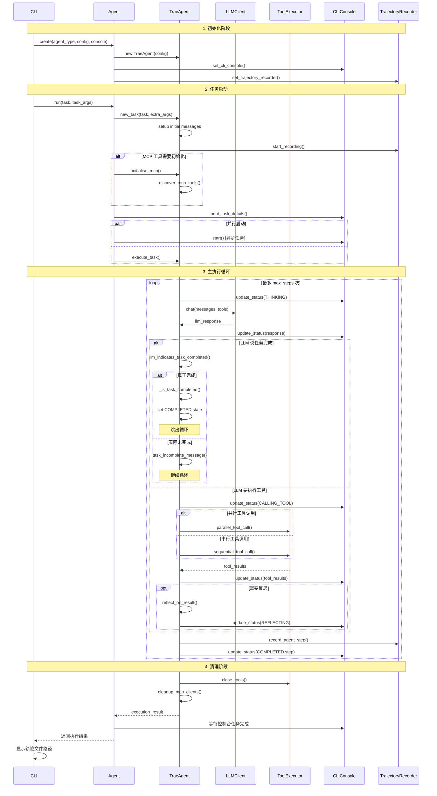
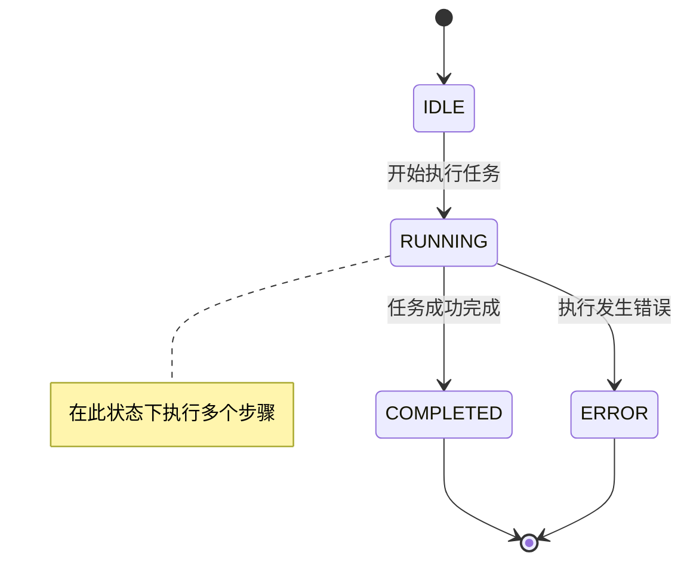
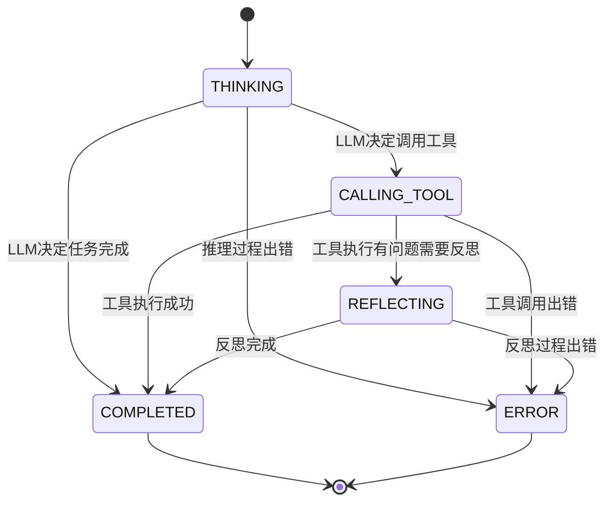
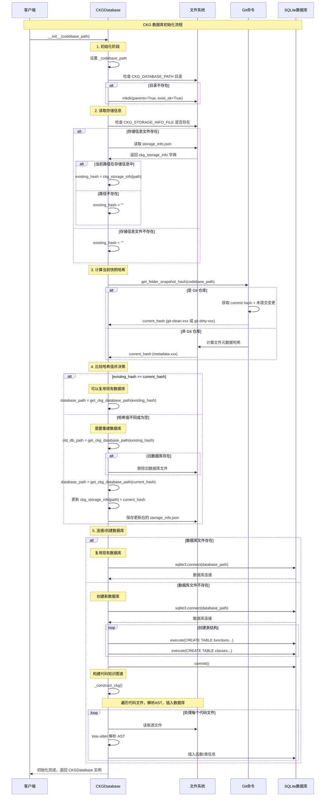
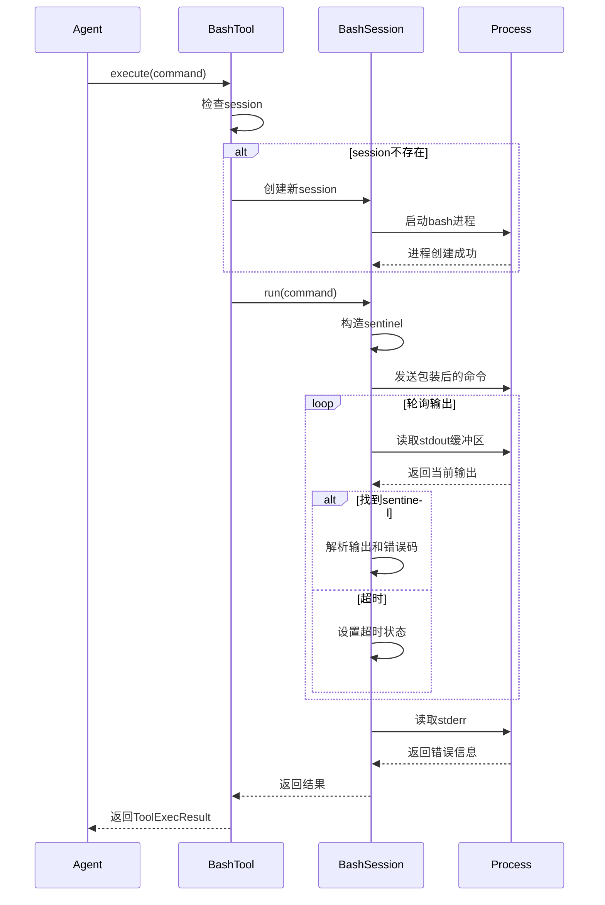

+++
date = '2025-09-26T17:18:14+08:00'
title = 'Trae Agent 源码阅读'
+++


## 项目概览


项目地址：[trae-agent](https://github.com/bytedance/trae-agent)
本文分析基于 Git commit 2cb657823bc5f9bdf276a69d2bcdd60ec389de46 版本


Trae agent 是字节开源的 LLM Agent，用于解决通用软件领域问题。项目包含了 UI (CLI) 和 Agent 部分，本文着重研究核心的  Agent 部分。


### 目录结构

```shell
trae-agent/
├── trae_agent/                       # 核心包目录
│   ├── agent/                        # Agent核心逻辑
│   │   ├── agent_basics.py           # 基础数据结构 (AgentState, AgentStep)
│   │   ├── base_agent.py             # 抽象基类 (ReAct循环逻辑)
│   │   ├── trae_agent.py             # 具体实现 (软件工程专用)
│   │   ├── agent.py                  # 包装器 (外观模式)
│   │   └── docker_manager.py         # Docker环境管理
│   │
│   ├── tools/                        # 工具集合
│   │   ├── base.py                   # 工具基类和接口
│   │   ├── bash_tool.py              # Shell命令执行
│   │   ├── edit_tool.py              # 文件编辑工具
│   │   ├── json_edit_tool.py         # JSON编辑工具
│   │   ├── task_done_tool.py         # 任务完成工具
│   │   ├── sequential_thinking_tool.py # 结构化思考
│   │   ├── mcp_tool.py               # MCP协议工具
│   │   └── ckg/                      # 代码知识图谱
│   │
│   ├── utils/                        # 工具类模块
│   │   ├── llm_clients/              # LLM客户端
│   │   │   ├── llm_client.py         # 统一客户端接口
│   │   │   ├── anthropic_client.py   # Claude集成
│   │   │   ├── openai_client.py      # GPT集成
│   │   │   ├── google_client.py      # Gemini集成
│   │   │   └── ...                   # 其他LLM提供商
│   │   │
│   │   ├── cli/                      # 命令行界面
│   │   │   ├── console_factory.py    # 控制台工厂
│   │   │   ├── simple_console.py     # 简单文本界面
│   │   │   └── rich_console.py       # 富文本界面
│   │   │
│   │   ├── config.py                 # 配置管理
│   │   ├── trajectory_recorder.py    # 轨迹记录
│   │   └── mcp_client.py             # MCP协议客户端
│   │
│   ├── prompt/                       # 提示词管理
│   │   └── agent_prompt.py           # Agent提示词
│   │
│   ├── cli.py                        # 命令行入口
│   └── dist/                         # 分发工具
│
├── evaluation/                       # 评估框架
│   ├── run_evaluation.py             # SWE-bench评估脚本
│   ├── utils.py                      # 评估工具函数
│   └── patch_selection/              # 补丁选择评估
│
├── tests/                            # 测试套件
│   ├── agent/                        # Agent测试
│   ├── tools/                        # 工具测试
│   └── utils/                        # 工具类测试
│
├── docs/                             # 文档
│   ├── tools.md                      # 工具文档
│   └── TRAJECTORY_RECORDING.md       # 轨迹记录文档
│
├── server/                           # FastAPI服务端 (可选)
│
├── pyproject.toml                    # Python项目配置
├── trae_config.yaml.example          # 配置模板
└── README.md                         # 项目说明
```

### 关系图谱

```mermaid
graph TB
    %% 外部接口层
    CLI[CLI Interface<br/>trae_agent/cli.py] --> Agent[Agent<br/>trae_agent/agent/agent.py]
    Server[FastAPI Server<br/>server/] --> Agent
    
    %% 代理层
    Agent --> TraeAgent[TraeAgent<br/>trae_agent/agent/trae_agent.py]
    Agent --> BaseAgent[BaseAgent<br/>trae_agent/agent/base_agent.py]
    TraeAgent -.-> BaseAgent
    
    %% 配置层
    Config[Configuration<br/>trae_agent/utils/config.py] --> Agent
    Config --> TraeAgent
    
    %% LLM 客户端层
    BaseAgent --> LLMClient[LLM Client<br/>trae_agent/utils/llm_clients/]
    LLMClient --> Anthropic[anthropic_client.py]
    LLMClient --> OpenAI[openai_client.py]
    LLMClient --> Google[google_client.py]
    LLMClient --> Ollama[ollama_client.py]
    LLMClient --> Azure[azure_client.py]
    LLMClient --> Doubao[doubao_client.py]
    LLMClient --> OpenRouter[openrouter_client.py]
    
    %% 工具执行层
    BaseAgent --> ToolExecutor[Tool Executor<br/>trae_agent/tools/base.py]
    BaseAgent --> DockerToolExecutor[Docker Tool Executor<br/>trae_agent/tools/docker_tool_executor.py]
    
    ToolExecutor --> ToolRegistry[Tools Registry<br/>trae_agent/tools/__init__.py]
    DockerToolExecutor --> ToolRegistry
    
    %% 工具实现层
    ToolRegistry --> BashTool[Bash Tool]
    ToolRegistry --> EditTool[Text Editor Tool]
    ToolRegistry --> JSONEditTool[JSON Edit Tool]
    ToolRegistry --> ThinkingTool[Sequential Thinking Tool]
    ToolRegistry --> TaskDoneTool[Task Done Tool]
    ToolRegistry --> CKGTool[Code Knowledge Graph Tool]
    
    %% MCP 工具层
    TraeAgent --> MCPClient[MCP Client<br/>trae_agent/utils/mcp_client.py]
    MCPClient --> MCPTool[MCP Tools<br/>trae_agent/tools/mcp_tool.py]
    
    %% Docker 管理层
    BaseAgent --> DockerManager[Docker Manager<br/>trae_agent/agent/docker_manager.py]
    
    %% 控制台层
    Agent --> CLIConsole[CLI Console<br/>trae_agent/utils/cli/]
    CLIConsole --> SimpleConsole[Simple Console]
    CLIConsole --> RichConsole[Rich Console]
    
    %% 轨迹记录层
    Agent --> TrajectoryRecorder[Trajectory Recorder<br/>trae_agent/utils/trajectory_recorder.py]
    
    %% 提示层
    TraeAgent --> SystemPrompt[System Prompt<br/>trae_agent/prompt/agent_prompt.py]
    
    %% 评估层
    Evaluation[Evaluation<br/>evaluation/] --> Agent
    Evaluation --> SWEBench[SWE-bench]
    Evaluation --> SWEBenchLive[SWE-bench-Live]
    Evaluation --> MultiSWEBench[Multi-SWE-bench]
    
    %% 测试层
    Tests[Tests<br/>tests/] -.-> Agent
    Tests -.-> ToolRegistry
    Tests -.-> Config
    
    %% 样式定义
    classDef interface fill:#e1f5fe,stroke:#01579b,stroke-width:2px
    classDef core fill:#f3e5f5,stroke:#4a148c,stroke-width:2px
    classDef tools fill:#e8f5e8,stroke:#1b5e20,stroke-width:2px
    classDef llm fill:#fff3e0,stroke:#e65100,stroke-width:2px
    classDef utils fill:#f1f8e9,stroke:#33691e,stroke-width:2px
    classDef eval fill:#fce4ec,stroke:#880e4f,stroke-width:2px
    
    class CLI,Server interface
    class Agent,TraeAgent,BaseAgent core
    class ToolExecutor,DockerToolExecutor,ToolRegistry,BashTool,EditTool,JSONEditTool,ThinkingTool,TaskDoneTool,CKGTool,MCPTool tools
    class LLMClient,Anthropic,OpenAI,Google,Ollama,Azure,Doubao,OpenRouter llm
    class Config,CLIConsole,TrajectoryRecorder,DockerManager,MCPClient,SystemPrompt utils
    class Evaluation,SWEBench,SWEBenchLive,MultiSWEBench,Tests eval
```



## 核心流程



Trae Agent 整体设计上采用了 ReAct 模式，当创建 Agent 实例并初始化资源后，开始在循环中执行任务，交替执行 LLM 推理、工具执行，失败反思步骤，直到任务完成。
任务的完成分为两步，一是解析 LLM 的 Response 中是否有任务结束标识（ 是否包含 `task_done` 等关键字），二是当必须有代码变更时，检查是否有除了 test 文件之外的的改动（TODO：什么情况下才必须要有代码变更？）。

```python
@override  
def _is_task_completed(self, llm_response: LLMResponse) -> bool:  
    """Enhanced task completion detection."""  
    if self.must_patch == "true":  
        model_patch = self.get_git_diff()  
        patch = self.remove_patches_to_tests(model_patch)  
        if not patch.strip():  
            return False  
  
    return True

def remove_patches_to_tests(self, model_patch: str) -> str:  
    """  
    Remove any changes to the tests directory from the provided patch.    This is to ensure that the model_patch does not disturb the repo's    tests when doing acceptance testing with the `test_patch`.    """    lines = model_patch.splitlines(keepends=True)  
    filtered_lines: list[str] = []  
    test_patterns = ["/test/", "/tests/", "/testing/", "test_", "tox.ini"]  
    is_tests = False  
  
    for line in lines:  
        if line.startswith("diff --git a/"):  
            target_path = line.split()[-1]  
            is_tests = target_path.startswith("b/") and any(  
                p in target_path for p in test_patterns  
            )  
  
        if not is_tests:  
            filtered_lines.append(line)  
  
    return "".join(filtered_lines)
```

当执行步骤（轮次）超过 max_steps 限制时，会抛出 `Task execution exceeded maximum steps without completion.` 错误中止任务。


### 状态转换

Trae Agent 核心包括两个状态
- AgentState：单次任务生命周期内的状态
- AgentStepState：每轮执行步骤内的状态

一个 AgentState 内会有多个（轮）AgentStepState。每一轮步骤执行完成之后，都会创建一个新的 AgentStepState ，AgentStepState 的状态不会回退或者说状态机没有环。这种状态拆分的设计非常符合Agent 需要在循环内执行的情况。

```python
class AgentState(Enum):  
    """Defines possible states during an agent's execution lifecycle."""  
  
    IDLE = "idle"  
    RUNNING = "running"  
    COMPLETED = "completed"  
    ERROR = "error"

class AgentStepState(Enum):  
    """Defines possible states during an agent's execution lifecycle."""  
  
    THINKING = "thinking"  
    CALLING_TOOL = "calling_tool"  
    REFLECTING = "reflecting"  
    COMPLETED = "completed"  
    ERROR = "error"  

```


AgentState 状态扭转



AgentStepState 状态扭转


## 工具

Trae Agent 内置了下面工具
- CKG：代码知识图谱
- Bash
- Docker tool Execute
- Edit
- Json Edit：专门为 json 文件编辑设计
- MCP
- Sequential Thinking Tool：思考工具
- Task Done： 虚拟工具，用于标记任务结束

工具基类以及工具参数设计：
```python
class Tool(ABC):
    """Base class for all tools."""
	...

    @abstractmethod
    def get_name(self) -> str:
        """Get the tool name."""
        pass

    @abstractmethod
    def get_description(self) -> str:
        """Get the tool description."""
        pass

    @abstractmethod
    def get_parameters(self) -> list[ToolParameter]:
        """Get the tool parameters."""
        pass

    @abstractmethod
    async def execute(self, arguments: ToolCallArguments) -> ToolExecResult:
        """Execute the tool with given parameters."""
        pass
	...
	
@dataclass
class ToolParameter:
    """Tool parameter definition."""

    name: str
    type: str | list[str]
    description: str
    enum: list[str] | None = None
    items: dict[str, object] | None = None
    required: bool = True
```

每个工具的实现需要实现下面方法
- get_name：工具标识，用于获取工具实例
- get_description：工具描述，用于LLM 调用中的 Function Call
- get_parameters：工具参数集合
- execute：工具执行逻辑

### CKG Tool

CKG 为代码知识图谱工具，用于构建和查询代码库的结构化信息。它提供三个核心功能：
- search_function: 搜索函数定义
- search_class: 搜索类定义
- search_class_method: 搜索类方法

用于解决下面这几类问题
- 代码理解: 快速定位函数和类的定义
- 代码导航: 找到具体的实现位置和行号
- 上下文分析: 了解函数/类的完整代码和结构信息

#### CKG Schema
Agent 会为每一个代码仓库快照构建一个database， 储存于本地的 sqlite，表结构如下
```sql
-- 函数表
CREATE TABLE functions (
	id INTEGER PRIMARY KEY,
	NAME TEXT NOT NULL, -- 函数名
	file_path TEXT NOT NULL, -- 文件路径
	body TEXT NOT NULL, -- 函数体代码
	start_line INTEGER, -- 起始行号
	end_line INTEGER, -- 结束行号
	parent_function TEXT, -- 父函数（嵌套函数）
	parent_class TEXT -- 所属类（方法）
);

-- 类表
CREATE TABLE classes (
	id INTEGER PRIMARY KEY,
	NAME TEXT NOT NULL, -- 类名
	file_path TEXT NOT NULL, -- 文件路径
	body TEXT NOT NULL, -- 类体代码
	fields TEXT, -- 字段列表
	methods TEXT, -- 方法列表
	start_line INTEGER, -- 起始行号
	end_line INTEGER -- 结束行号
)
```


#### 构建逻辑

CKG 会在 Agent 初始化时执行预清理清除旧的数据库，在工具被首次执行的时候懒加载，构建流程如下图。
构建时会以代码库的快照哈希判断是否需要重建。
代码库的快照哈希
- Git 仓库：基于 commit + 未提交变更
- 非 Git：基于文件元数据（文件名+修改时间+文件大小）





目前支持部分语言构建代码知识图谱：
- python
- Java
- Cpp
- C
- Typescript
- Javascript


### Bash  Tool

Trae Agent 提供了 bash 工具，支持在 Unix 和 Windows 下工作。通过 bash shell 工具，可以支持执行各种复杂命令以及持久化会话状态。



####  Sentinel机制
因为 bash shell 是一直存在于 task 声明周期内的，并不是一次执行，所以需要一个标记机制用于获取命令的输出。
通过在执行命令后面附加 `echo sentinel` ，可以通过sentinel 标识区分获取任务的结束输出以及错误码。

```python
_sentinel: str = ",,,,bash-command-exit-__ERROR_CODE__-banner,,,," # `__ERROR_CODE__` will be replaced by `$?` or `!errorlevel!` later

sentinel_before, pivot, sentinel_after = self._sentinel.partition("__ERROR_CODE__")  
assert pivot == "__ERROR_CODE__"  
  
errcode_retriever = "!errorlevel!" if os.name == "nt" else "$?"  
command_sep = "&" if os.name == "nt" else ";"

# send command to the process  
self._process.stdin.write(  
    b"(\n"  
    + command.encode()  
    + f"\n){command_sep} echo {self._sentinel.replace('__ERROR_CODE__', errcode_retriever)}\n".encode()  
)  
await self._process.stdin.drain()  
  
# read output from the process, until the sentinel is found  
try:  
    async with asyncio.timeout(self._timeout):  
        while True:  
            await asyncio.sleep(self._output_delay)  
            # if we read directly from stdout/stderr, it will wait forever for  
            # EOF. use the StreamReader buffer directly instead.            output: str = self._process.stdout._buffer.decode()  # type: ignore[attr-defined] # pyright: ignore[reportAttributeAccessIssue, reportUnknownMemberType, reportUnknownVariableType]  
            if sentinel_before in output:  
                # strip the sentinel from output  
                output, pivot, exit_banner = output.rpartition(sentinel_before)  
                assert pivot  
  
                # get error code inside banner  
                error_code_str, pivot, _ = exit_banner.partition(sentinel_after)  
                if not pivot or not error_code_str.isdecimal():  
                    continue  
  
                error_code = int(error_code_str)  
                break  
except asyncio.TimeoutError:  
    self._timed_out = True  
    raise ToolError(  
        f"timed out: bash has not returned in {self._timeout} seconds and must be restarted",  
    ) from None

```


### Edit Tool

Edit Tool 其实文件交互工具，不仅仅包含编辑文件的功能，还提供了查看文件的功能，提供下面模式命令
- view：查看文件内容，支持指定范围
- create：创建文件并写入
- str_replace：替换文件中的指定内容
	- 注意：当替换内容在文件出现多次时会报错提示 LLM 
- insert：在文件指定行处插入内容

该工具的实现并不复杂，这里不展开讲解具体逻辑。

#### 文件路径校验

路径参数只支持绝对路径，报错还会给出可能的路径。基本上所有的 coding agent 的实现都推荐使用决定路径作为工具参数。

```python
def validate_path(self, command: str, path: Path):
        """Validate the path for the str_replace_editor tool."""
        if not path.is_absolute():
            suggested_path = Path("/") / path
            raise ToolError(
                f"The path {path} is not an absolute path, it should start with `/`. Maybe you meant {suggested_path}?"
            )
        # Check if path exists
        if not path.exists() and command != "create":
            raise ToolError(f"The path {path} does not exist. Please provide a valid path.")
        if path.exists() and command == "create":
            raise ToolError(
                f"File already exists at: {path}. Cannot overwrite files using command `create`."
            )
        # Check if the path points to a directory
        if path.is_dir() and command != "view":
            raise ToolError(
                f"The path {path} is a directory and only the `view` command can be used on directories"
            )
```

#### 结果输出
在工具完成任务后会输出相对友好的改动范围，作为工具输出反馈给LLM ，还可以用于 UI 展示

```python
def str_replace(self, path: Path, old_str: str, new_str: str | None) -> ToolExecResult:
	    ... # 文件内容替换

        # Create a snippet of the edited section
        replacement_line = file_content.split(old_str)[0].count("\n")
        start_line = max(0, replacement_line - SNIPPET_LINES)
        end_line = replacement_line + SNIPPET_LINES + new_str.count("\n")
        snippet = "\n".join(new_file_content.split("\n")[start_line : end_line + 1])

        # Prepare the success message
        success_msg = f"The file {path} has been edited. "
        success_msg += self._make_output(snippet, f"a snippet of {path}", start_line + 1)
        success_msg += "Review the changes and make sure they are as expected. Edit the file again if necessary."

        return ToolExecResult(
            output=success_msg,
        )

def _make_output(
    self,
    file_content: str,
    file_descriptor: str,
    init_line: int = 1,
    expand_tabs: bool = True,
):
    """Generate output for the CLI based on the content of a file."""
    file_content = maybe_truncate(file_content)
    if expand_tabs:
        file_content = file_content.expandtabs()
    file_content = "\n".join(
        [f"{i + init_line:6}\t{line}" for i, line in enumerate(file_content.split("\n"))]
    )
    return (
        f"Here's the result of running `cat -n` on {file_descriptor}:\n" + file_content + "\n"
    )
```


### Sequential Thinking Tool

顺序思考工具 ，在 trae-agent 中用于帮助 AI 进行结构化思考和问题分解的工具。

#### Prompt
工具的描述即是 Prompt 的 一部分，引导 LLM 进行反思推理。
```shell
A detailed tool for dynamic and reflective problem-solving through thoughts.
This tool helps analyze problems through a flexible thinking process that can adapt and evolve.
Each thought can build on, question, or revise previous insights as understanding deepens.

When to use this tool:
- Breaking down complex problems into steps
- Planning and design with room for revision
- Analysis that might need course correction
- Problems where the full scope might not be clear initially
- Problems that require a multi-step solution
- Tasks that need to maintain context over multiple steps
- Situations where irrelevant information needs to be filtered out

Key features:
- You can adjust total_thoughts up or down as you progress
- You can question or revise previous thoughts
- You can add more thoughts even after reaching what seemed like the end
- You can express uncertainty and explore alternative approaches
- Not every thought needs to build linearly - you can branch or backtrack
- Generates a solution hypothesis
- Verifies the hypothesis based on the Chain of Thought steps
- Repeats the process until satisfied
- Provides a correct answer

Parameters explained:
- thought: Your current thinking step, which can include:
* Regular analytical steps
* Revisions of previous thoughts
* Questions about previous decisions
* Realizations about needing more analysis
* Changes in approach
* Hypothesis generation
* Hypothesis verification
- next_thought_needed: True if you need more thinking, even if at what seemed like the end
- thought_number: Current number in sequence (can go beyond initial total if needed)
- total_thoughts: Current estimate of thoughts needed (can be adjusted up/down)
- is_revision: A boolean indicating if this thought revises previous thinking
- revises_thought: If is_revision is true, which thought number is being reconsidered
- branch_from_thought: If branching, which thought number is the branching point
- branch_id: Identifier for the current branch (if any)
- needs_more_thoughts: If reaching end but realizing more thoughts needed

You should:
1. Start with an initial estimate of needed thoughts, but be ready to adjust
2. Feel free to question or revise previous thoughts
3. Don't hesitate to add more thoughts if needed, even at the "end"
4. Express uncertainty when present
5. Mark thoughts that revise previous thinking or branch into new paths
6. Ignore information that is irrelevant to the current step
7. Generate a solution hypothesis when appropriate
8. Verify the hypothesis based on the Chain of Thought steps
9. Repeat the process until satisfied with the solution
10. Provide a single, ideally correct answer as the final output
11. Only set next_thought_needed to false when truly done and a satisfactory answer is reached
```

#### 结构化思考

```python
@dataclass
class ThoughtData:
    thought: str
    thought_number: int
    total_thoughts: int
    next_thought_needed: bool
    is_revision: bool | None = None
    revises_thought: int | None = None
    branch_from_thought: int | None = None
    branch_id: str | None = None
    needs_more_thoughts: bool | None = None
```

参数解释（其实就是对应上面 Prompt 部分的翻译）:
- thought: 您当前思考步骤，可以包括：
	- 常规分析步骤
	- 对先前想法的修订
	- 对先前决策的疑问
	- 关于需要更多分析的领悟
	- 方法的变化
	- 假设的生成
	- 假设的验证
- next_thought_needed: 需要更多思考时为True，即使看似已经结束
- thought_number: 当前序列中的编号（如有需要，可以超过初始总数）
- total_thoughts: 当前所需思考的估计（可上下调整）
- is_revision: 一个布尔值，表示此想法是否修订了先前的思考
- revises_thought: 如果is_revision为true，则正在重新考虑的想法编号
- branch_from_thought: 如果分支，则分支点的想法编号
- branch_id: 当前分支的标识符（如果有）
- needs_more_thoughts: 如果到达终点但意识到需要更多思考

**这个思考工具通过结构化的设计（强校验）以及引入序列版本号、分支、修订机制让 LLM 的推理更加强大，可以追溯之前的思路一步步演进和返工重来。**


## 评估


